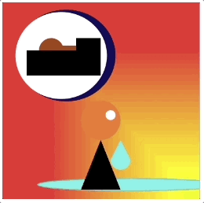

# 🎨 Unit 1 Final Project: Abstract Album Art

### Teacher Notes and Overview

This culminating project of Unit 1 is meant as a showcase for all skills students have learned up until this point. It is equally meant to be a creative exploration that allows students to try their skills at art and design and justify their decisions.

Emphasis should be placed on the justification, as many students have anxiety when asked to produce work judged on artistic merit. For students who do not feel they can connect with music, encourage them to think of something in their life they can represent abstractly.

This project is a great way for students to open up and take advantage of their creative freedom!

The launch for this project can utilize one of two (or both, or none) videos found in the resources folder. One of the videos gives a humorous look into the benefits of abstract art; the other is a more scientific look into synesthesia and should provide a grounding for students as to how shapes can convey more than just ‘round’ or ‘pointy.’ Read your class to decide what type of motivation they might need!

This project is best assessed with a written accompaniment where students justify their design decisions. You may want to provide sentence starters for this activity.

<figure><figcaption></figcaption></figure>

### Objectives

**Students will be able to:**

* Showcase skills learned in Unit 1
* Create an abstract representation of a mood or theme using Processing.py

### Suggested Duration

\~1-2 periods for launch/planning (\~45 - 90 minutes)

\~2-3 Periods for coding (\~90 - 125 minutes)

_This is all quite subjective; in early projects, you should adjust the pace to suit your students so they can make something they are proud of. But this project should take about a week._

### Planning Notes and Materials

|                                                                                        Planning Notes                                                                                        | Materials |
| :------------------------------------------------------------------------------------------------------------------------------------------------------------------------------------------: | :-------: |
| See above for timing - students should be held accountable for getting things done each day through a series of check ins, but they also need a chance to make something meaningful to them. |           |

### Resources

* [Synthesia Video](https://www.ted.com/talks/neil\_harbisson\_i\_listen\_to\_color)
* [Tom Loves Art](https://drive.google.com/file/d/1EXmFCoCqWhOd\_rgaC3ZR1dxpRyAdZmKk/view?usp=share\_link) (Abstract Art && Parks and Rec)
* [Unit Project Launch](https://youtu.be/hOvPl0cDPeI) (Youtube Video)

### Project Launch  (12 - 20 minutes)

<figure><figcaption>
Table comparing realistic images to abstract representations
</figcaption></figure>

Students have already talked about abstraction, so this is a review of the core concept. Display the table of images above. Ask students: based on these images and our prior conversations, what do you think it means to be less or more abstract?

Remind students that abstraction is generally a way to simplify things by removing details, in much the same way they've been doing with their functions: they hide the actual steps or algorithm needed to make something happen inside the function, so that when coding, they just have to worry about the function name.

In this final project, students will be abstracting both their code _and_ their art!

In the fine art world, abstraction is often used to simplify complex ideas or themes by representing moods, emotions, and feelings with colors, shapes, and patterns. There are even some artists who specialize in abstract art.

You might want to show students [this video](https://drive.google.com/file/d/1EXmFCoCqWhOd\_rgaC3ZR1dxpRyAdZmKk/view?usp=share\_link) to get them motivated to try abstract art. A useful (but optional) launch activity between this video and the project is to have students practice drawing abstract art. Ask them to split their paper into three or four equal sections, and then explain that they will practice making abstract art based on songs that you play for them. Try to pick songs that they may not be familiar with and that each have a different mood/pace so they have to be in the moment! Ask students to create an abstract art piece for each song (give only 1-2 minutes for this process) that captures the mood and feeling of the piece.

Another interesting approach to get students to think about creating abstract art for albums, in particular, is to have them [watch this video on synesthesia](https://www.ted.com/talks/neil\_harbisson\_i\_listen\_to\_color). (You could also play this video during/right before planning.)

### Project Prompt

Students will create an abstract art piece that can serve as album art for a song, or can represent a poem or other literary work if they so choose. This is fairly open-ended: if students want to try interpreting something unique, let them!

**Requirements:**

1. Use shapes that we covered in this unit.
2. Use built-in variables that make your design dynamic (like size or color changes with mouse position).
3. Have your design change slightly each time it is run by using the random feature with some of your custom variables. (EX: have parts of your design move slightly each time the program is run, or shift slightly in color)
4. Create & use custom variables to control two or more elements of your design.
5. Create & use custom functions for two or more repeated and/or complex elements of your design.
6. Store custom functions in a separate, linked code document.
7. All code should be documented and commented.

**Writing Prompt:**

Write a paragraph explaining your design decisions, including color choice and composition, and why it is representative of the album you chose.

**Sample Output:**

<figure><figcaption>
<strong>Gif of a sample album art</strong>
</figcaption></figure>

[**Exemplar Project**](https://trinket.io/library/trinkets/0b9e1a3445) created by CS4All Pathfinder intern.

_**NB:** Before students get started, plan on having them draw out their ideas. It might be useful to create a planning sheet where students can draw their ideas but also record things like color palette, where they’ll use variables, etc, etc. Plan on a solid period of paper wireframing before students move to computers._

### Wrap-Up

A good practice, especially during long-term projects, is to have students share their progress. You can do this through volunteers, or as is my preference, through random selection.

This share-out method can be used outside of project time, as well. Use a calendar to sign up 1-2 students per day, working your way through your roster (and then repeating once you reach the end). Each day, be sure to conference or check-in with students who will share so they are aware they are sharing and also know what they will talk about. Students can share successes or struggles - if they share a success, they should focus on what they did to make it happen (so the class can learn). If they share a struggle, they should ask questions that the class can then assist them. Allow about 5 minutes for both shares.

### Culturally Responsive Best Practices

Within this design-based challenge, there are many prompts you can give students to make the project seem more relevant to them and the cultures of communities that they are a part of. (_Please recall that communities can refer to a lot of things, including just the culture of being a teen, a Minecraft player, or a KPop fan - be mindful that you are allowing students to explore choice in their creations in a way that is authentic to them!)_

_**Allowing for student choice in this project is one of the best ways to be culturally responsive!**_ Allow students freedom to pick the song/poem/whatever that is most meaningful to them - if they say it is important, accept it as important.

### Extensions

For students racing ahead, first ask them to try to make their code as efficient as possible by deleting any superfluous lines and utilizing abstraction whenever possible. The real challenge here is to perfect their art and design, so turning towards those principles can also be helpful.

