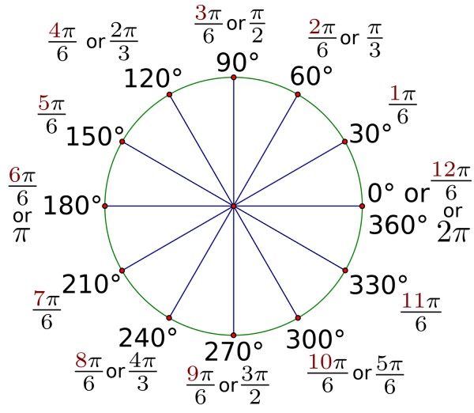

# U3LA1.2: For Loops Pt. 1

### Teacher Notes and Overview

\[COME BACK AT THE END]

### Objectives

Students will be able to:

* Explain how the components of the for loops are essential to efficiency&#x20;
* Create for loops&#x20;
* Use for loops to generate multiple shapes Use for loops to increment color change
* Explain the difference between while and for loops
* Use for loops to generate multiple shapes&#x20;

### Suggested Duration

2-3 Class Periods (\~90 - 135 minutes)

### NYS Standards

**9-12.CT.4** Implement a program using a combination of student-defined and third-party functions to organize the computation.

**9-12.CT.8** Develop a program that effectively uses control structures in order to create a computer program for practical intent, personal expression, or to address a societal issue.

**9-12.DL.1** Type proficiently on a keyboard.

**9-12.DL.2** Communicate and work collaboratively with others using digital tools to support individual learning and contribute to the learning of others.

### Vocabulary

* **Loops** - A sequence of instructions that is repeated until a certain condition is met.&#x20;
* **Iterations** - the repetition of a process or utterance.&#x20;
* **For loop** - loops through a block of code a number of times

### Planning Notes and Materials

|                                                     Planning Notes                                                    |           Materials          |
| :-------------------------------------------------------------------------------------------------------------------: | :--------------------------: |
| There are no specific planning notes for this lesson, but it is the first lesson students will be using media - whoo! | No special materials needed. |

### Resources

* NEED FOR LOOP PYTHON VIDEO
* Python For Loops ([W3 Schools](https://app.gitbook.com/s/mX4RubbWI5h0C0nJu6Na/))
* Styling For Loops Starter Code ([Trinket](https://trinket.io/library/trinkets/856bc608b0))

### Assessments

**Formative:**

* Do Now (modifying sketch to include for loop)
* Exercises 1 and 2
* Wrap Up Assignment

**Summative:**

* Create a Wallpaper (Upcoming Mini Project)

### Do Now/Warm Up (\~3 - 5 minutes)

_Ask students to explain what would happen in each of these different scenarios, and specifically how the outcomes would be different:_

Your teacher has come to class with a big bag of candy. They offer each of the following scenarios:

1. They can give out a piece of candy to each student while the bag is still full.
2. They can give out a piece of candy **for** each student.

What would happen in each of these scenarios? How do they differ? Is there a situation where you anticipate getting more/less candy than the other? Why?

_After students have had think time, feel free to share and/or act out the situation (bringing actual candy is an easy win for this). In the WHILE scenario they will keep getting candy as long as there is candy in the bag - in the FOR, they will each only get one piece._

### Repeat Shapes with a For Loop (\~10 - 15 minutes)

Explain to students that WHILE and FOR (be careful to specify this is NOT the number) are both control structures that act as loops. They behave a little differently, but their main components are similar. One way to think of it is like this: what's the difference between saying 'I will give each student in here a piece of candy while I have candy in this bag' and 'For each student, give one piece of candy'? (You can also act this out with some advanced prep - the while will keep repeating until the candy is out, the for will end once every student has one piece of candy.)

Our for loop has a different structure than our while loop. In Python, a for loop might look like:

```
for x in range (10, 400, 20):
    ellipse(x, 20, 10)
```

Explain to students that this for loop once again uses a variable - this is our _iterative_ or _iterating_ variable as it will change each itme. It can be anything that makes sense - in this case, `x`, since we are changing the x position - but it coulda also be `y`, or (traditionally) `i`, or even `each` or `fuzzySlippers`. All would be acceptable, but some are easier or harder to read than others!

In Python, for loops can work on arrays or with numbers. For numbers, we need that keyword `range` which then accepts several values. The first is the starting value of the loop, and the last is where the loop should end. Please note that in loops this final number is _exclusive,_ meaning that it will stop counting at 399 and not execute the code with 400.

The third value in the parentheses is optional - it determines what we are skip counting by. In this case, we are skip counting by 20s, so the first iteration of x is 10, then 30, then 50, etc. This takes the place of our `x = x + 20` that we needed to include at the end of our while loop! _Please note that in Python, if a third number is not included, it will automatically count by one._

Students should notice that the for loop contains the same three important elements that we needed in a While loop - they're just all built-in! Repeat the importance for loops of:

1. Creating a variable to increment
2. Setting an amount of time the loop will run for
3. Determining how the variable will increment (_skip count_)

Once students are familiar with this as an idea, pause to do a brief code along with them to get a row of shapes on the screen. The shape can be anything - here an ellipse is used as an example, but do what makes your students happy.

```
for i in range (0, width, 50):
    ellipse(i, 75, 200)
    print(i) #feel free to add or remove this - it's just for show!
```

Stress the syntax of the for loop during this code along, specifically the purpose of each number in range, the flexibility of the variable name, and the use of the word 'range' itself.

Once the code is in, encourage students to explore it in the same way they explored while loops. What if the numbers in range are a bit different? What happens?

After students have had a chance to explore, explain that they will be completing two challenges before you move on. (This can be done independently, as a pair programming activity, or in small, collaborative groups, as you see fit.) **They will need to write a new for loop for each challenge.** Encourage them to TYPE the loops so they get used to syntax!

* **Challenge 1:** Use a for loop to **draw a column of shapes** that goes up and down the page.&#x20;
* **Challenge 2:** Use a for loop to **draw a line of shapes that goes diagonally** across the page. (HINT: To be diagonal, the x and y values of the shape must both be changing together! Think about math and slope!)

Allow students 7 - 12 minutes to work on these challenges, and then come back together to discuss. Depending on the student's math level, they may need to review diagonally lines, which would simply be a change in both x and y, like so:

```
for i in range (0, width, 50):
    ellipse(i, i, 200)
```

### More Practice (10 - 15 minutes)

If you would like students to have more practice making purposeful for loops, consider asking them to try to recreate one or all of the following:

<figure><figcaption></figcaption></figure>

Mild and medium are versions of things students have already created. Spicy can be achieved with the following solution (among others!):

```
x = width #start x on the right side of the canvas

for y in range(0, height, 40):
    ellipse(y, y, 20, 20)
    
    ellipse(x, y, 20, 20)
    x = x - 40 #subract 40 from x in each iteration

```

### Varying with For Loops - _Intro_ (5 min)

_It is very likely that the above content will take a full class period - feel free to use the introduction of this section as a Do-Now/Warm Up Activity. Alternatively, it can be used to simply allow students to shift their thinking from one task to the next!_

Display the following and ask students to recreate:

<figure><figcaption><p>A row of ellipses increasing in size</p></figcaption></figure>

_In previous lessons, students used for loops to create columns, rows, and diagonal rows. Ideally, we would want students to be using for loops to create a row of 5 circles so if students are still having some confusion with for loops use this opportunity to review loops. Ask any student who was able to create the image above to share out their solution with the class._

### Incrementing Size, Incrementing Color, Specific Numbers of Repetitions (10 - 15 minutes)

Students may have taken several paths to recreate the Do Now image; some may have made many ellipses, and some will hopefully still be thinking _for loops_ to make it happen. Regardless of where your class is, make sure that they take some time to code along this example and get everyone on the same page:

```
for x in range(100, width, 100):
    ellipse(x, 60, x/10, x/10)
```

The big takeaway here is that **the iterating variable can be used to control more than just position.** This can be, conceptually, quite big for the students; they need to understand that the variable is not _required_ to do any one thing other than hold a number that is slowly incrementing in value, and that number can be used anywhere a number may go in their code. Since we control most everything with numbers, this leaves them with a lot of options!

The second big push for students to get through is that you can do math to - and with - the variable. From where you started, go back to the start, here:

```
for x in range(100, 600, 100):
    ellipse(x, 200, x, x)
```

This will produce a result like:

<figure><figcaption><p>Overlapping ellipses that increase in size</p></figcaption></figure>

Explain to students that this result is based on the x values getting bigger and controlling the size of the shape, and as we can see, they eventually get so big that the ellipses run off the screen. If the students need an explainer, do a little labeling as you walk through the loop: in the first iteration x is 100, then 200, then 300... all the way until it's massive!

By dividing the x value as we did in the do now, these numbers become more manageable. In the first iteration, instead of 100 the width would be x/10, or 100/10, which would be 10. Then it would be 200/10, which would be 20, so on and so forth until the loop is done running. (If they try to divide by different values, they'll get different results. Play with that together!)

Just to make it abundantly clear, make sure students know that division is just the tip of the iceberg - they can always try multiplying or adding/subtracting to see what results they get, as well! This can be a little nerve-wracking for math fearful students, and it doesn't need to be. Be sure to remind students that it is not at all about them knowing the exact number that is happening as a result of the math they're doing - they just need to be aware of how the operations and values they choose to use will affect the outputs generally. For example, understanding that dividing a whole number by another whole number will result in a smaller value.

There is also no reason to think that this trend of making changes with for loops wouldn't work in other situations. So let's try colors, shall we?

```
for x in range(100, 600, 100):
    fill(0, 0, x)
    ellipse(x, 100, 40, 40)
```

<figure><figcaption><p>Row of ellipses in subtly different colors of blue</p></figcaption></figure>

Remind students that color values only go up to 255 - so this is a great opportunity to divide the variable by a number so you have a wider range of color shifts! Give students a few minutes to experiment and play. You \*might\* even drop the idea that they try using `mouseX` or `Y` as a color value and dividing by an incrementing variable. (It's always a crowd-pleaser.)

### Student Activity: Create Your Own Incrementing Design (10 - 15 min)

Ask students to take what they have learned and try to create their own design by making a unique row of fully styled shapes. They should practice changing size, color, `strokeWeight`, transparency... anything and everything they can think of!

Students looking for an extra challenge may choose to try to style a design they've made previously, like in this example where the mouth of the emoji gets bigger over time:

<figure><figcaption><p>Row of emojis with each mouth getting larger</p></figcaption></figure>

```
from processing import *
from collide2d import *

def weirdFace(x, y):
    fill(255, 0 , 0)
    ellipse(x, y, 40, 40)
    fill(0)
    ellipse(x+7, y-5, 5, 10)
    ellipse(x-7, y-5, 5, 10)
    
    ellipse(x, y + 10, 7, x/25)

def setup():
    size(400,600)

def draw():
    background(220)
    text(str(mouseX) + ", " + str(mouseY), 20, 20)
    
    for x in range(100, 600, 100):
        weirdFace(x, 60)
    

draw = draw
run()
```

### {OPTIONAL} Counting in For Loops

This is entirely extra, but you may want to show students more ways to make precise things happen in loops. One way to make sure that, say, the loop always has 5 circles in it is to use a for loop that counts by ones instead of by huge gaps, and then multiplying that value to make the shapes show up as intended. For example:

```
for i in range (0, 5):
    ellipse(i*50, 200, 50)
```

Would have a similar result to the first for loop they ever saw, the incrementation is just occurring differently. It is _not_ required students know this, but for some, it may be helpful as another approach to looping!

Alternately, if students are uncomfortable with the math, they could create a separate variable that increments inside the loop, making this behave more like a while loop:

```
circSize = 400

for i in range(0, 5):
    ellipse(width/2, height/2, size, size)
    size = size - 60
```

### Wrap-Up (5 min)

Ask students to post their project links in a forum such as Slack or the Google Classroom. Then, have them view and comment on two other projects, leaving a glow and grow for each.

**Guiding questions:**

1. How can we use variables to change multiple parameters?
2. What are some other things we can increment with for loops?

### Extensions

Have students go back to their own personal emojis and create a new variation using incrementation.
