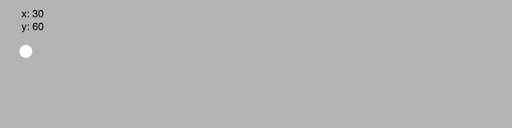

# U3LA1.3: Nested For Loops (For Loops Pt 2)

### Teacher Notes and Overview

In this learning activity, students will create a grid using nested for loops. This is a direct lead in to the mini project, which can serve as an extension to this lesson. (Or this lesson can serve as a launch for the mini project, depending on how you’d like to view it.)

Nested loops may be the most difficult loop concept to understand because of the syntax and the sequential logic behind creating the column or rows. So take your time with the lesson and ensure students are comfortable with creating for loops and suing for loops before starting this lesson.

Encourage students to use comments to help with organization, it will decrease the number of errors and questions. If some students are not fully able to understand the concept it is not essential for future lessons but it will be very useful to know especially for the wallpaper project. Creating a template of the nested for loop can also be very useful for confused students.

This pair programming experience is very open-ended - try to encourage students to talk together about features for their program, rather than each person deciding for the group when it is their turn to navigate.

Push students to think about the user experience in leaving their feedback: did they know while loop is working correctly? How could this be improved?

### Objectives

Students will be able to:

* Create for loops&#x20;
* Nest two for loops&#x20;
* Create a grid of shapes

### Suggested Duration

45 minutes (\~1 class period)

### NYS Standards

**9-12.CT.4** Implement a program using a combination of student-defined and third-party functions to organize the computation.

**9-12.CT.8** Develop a program that effectively uses control structures in order to create a computer program for practical intent, personal expression, or to address a societal issue.

**9-12.DL.1** Type proficiently on a keyboard.

**9-12.DL.2** Communicate and work collaboratively with others using digital tools to support individual learning and contribute to the learning of others.

### Vocabulary


### Planning Notes and Materials

|                                                      Planning Notes                                                     |             Materials            |
| :---------------------------------------------------------------------------------------------------------------------: | :------------------------------: |
| _There are no specific planning notes for this lesson, but it is the first lesson students will be using media - whoo!_ | **No special materials needed.** |

### Resources

* NEED PYTHON VIDEO ON NESTED LOOPS
*

### Assessments

**Formative:**

* Syntax in Do Now
* Use of Nested Loops in Learning Assignment
* Description in Wrap-Up

**Summative:**

* Create a Wallpaper (Upcoming Mini Project)

### Do Now/Warm Up (3 -7 minutes)

_Have students try to create a grid using the for loop method from the previous lessons._

<figure><figcaption><p><em>Image showing row of ellipses and several completed columns</em></p></figcaption></figure>

_Likely, students will attempt to make several separate for loops to solve this problem. This works, but it can be tedious and is often error prone!_

_Ask Students:_

1. How do you think we can do this in a more efficient way?&#x20;
   1. To break down all the parts of a grid (columns and rows).
2. Review how the position increments with each iteration.

### Nested For Loops (\~7 - 12 minutes)

The Do Now is the launch into this lesson: at this point, if we wanted to create a grid, we would need to create many separate for loops to control the x and y position of different rows and columns. This is fine, and sometimes what we want, but it is also _a lot_ of redundant code if we know we want a full grid of design.

Aside from being tedious and error-prone, our brains should be firing a flashing light whenever we see that much repetition: it usually means there is an easier, or at least more efficient, computational way to solve our problem.

In this example, we can accomplish creating an entire grid of shapes with _just two loops._ The catch is that we will be putting one inside the other; our goal is that the first loop will draw a row of circles, from left to right, but for each new circle placed, the second loop will draw a column going down. It will end up looking something like this in process (although it will appear static on screen unless we really mess with the frame rate):

<figure><figcaption><p>Gif of the grid of ellipses being constructed by going over and then down.</p></figcaption></figure>

This can be really confusing for students, and that's okay - they will probably have to dive into the loop itself and fiddle with some numbers before it sticks. As you are making the loop, feel free to come back to this gif or any sample drawing and walk through the process of what is happening to cement their understanding.

With your students, code out the following example in the draw function that you can use to explain (and that they can mess with):

```
for x in range(30, 600, 30):
    for y in range(30, 600, 30):
        ellipse(x, y, 15, 15)
```

The syntax of nesting for loops - and really anything - can be confusing at first. Remind students that in Python, the white space on the left side of the screen matters! We indent to show that something is 'inside' of something else. In this case, the second loop is indented under the first, meaning it is 'inside' of it, or happening as part of the loop itself. The ellipse, indented under both, is therefore a part of both loops and runs whenever the y loop runs, which runs when the x loop runs.

In the example above we draw an ellipse at an x location with the variable x and a y location with the variable y. X is incremented by 30 in the outer for loop (which will draw a row) and in the inner for loop, y is incremented by 30 (which will draw a column). Each time the x loop is run, it draws an ellipse in the row, as well as an entire column at that x location as illustrated by the animation above.

The first time the outer for loop runs, x is 30. Then the inner for loop runs. y starts at 30. A circle is drawn. y is set to 60. The second circle is drawn, 30 px below the first. Then y is set to 90, and a third circle is drawn, 30px below the previous one. Now the inner for loop is done, the outer loop sets x to 60, and the cycle continues.

You may need to describe this to students several times, and it's also recommended that you show them how the rows/columns can be changed by adjusting values in the loop. Start with the x loop to show how you can adjust that spacing and make it start/stop at different places, then do the same with the y loop. You may also choose to show them what happens if you make a shape in the x loop but not the y loop so they have a better sense of the control flow at play, here.

Once you feel like students have at least a basic grip of the logic happening in the code, it's time to send them off! With their partners, they should work on the activity below. This will solidify their understanding of for loops. Look out for curly bracket errors. Students may want to create new variables but encourage them to use the x and y variables they create in the for loops.

### Student Activity: Grid Design (10 - 15 minutes)

Ask students to go find a design they have made in the past, such as their emoji project or taijitu symbol. (Avoid having them make a brand new design unless it is comprised of 3 or less shapes and can be done in about five minutes.)

Then, ask students to use that design in a nested for loops to turn it in a grid, like so:

<figure><figcaption><p>Grid of consecutive rainbow circles</p></figcaption></figure>

Example Code:

```
def rainbowCircle(x, y):
   fill(255,0,0) #add a red fill
   ellipse(x,y,40,40)
   fill(0,255,0) #add a green fill
   ellipse(x,y,30,30)
   fill(0,0,255) #add a blue fill
   ellipse(x,y,20,20)
   fill(255,0,255) #add a purple fill
   ellipse(x,y,10,10)

def draw():
   background(220)
   
   for x in range(0, 600, 40):
      for y in range(0, 600, 40):
         rainbowCircle(x, y)
```

The focus here is on practice as opposed to innovation and creativitity ONLY because there is a mini project directly after this lesson that will allow them to use this skill in a more ✨creative/interesting ✨way. We want them to have practiced before getting there, but not get totally lost in making this new practice assignment (yet)!

### Wrap-Up (\~5 minutes)

Ask students to post their project links in a forum such as Slack or the Google Classroom. Then, have them view and comment on two other projects, leaving a glow and grow for each

**Guiding questions:**

* Explain how can you create a grid of shapes using nested for loops&#x20;
* Which errors can we get from nesting for loops?

### Extension

Give students specific and logically challenging tasks for while loops such as:

* Creating a grid of emojis&#x20;
* Using HSB values to make a rainbow grid.
