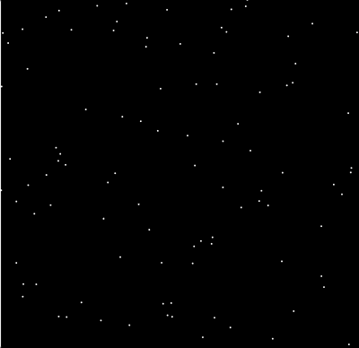

# U3LA2.3: Loops and Lists

### Teacher Notes and Overview

In this lesson, students will be introduced to the usage of loops to iterate through lists. They will also explore how they can add items to a list using a loop, and practice placing objects into lists.\
\
Iterating through a list is an important concept to know when working on this unit's final project. It would be a good idea for students to share out their solutions to the exercises so that you can clear up any misconceptions.

### Objectives

Students will be able to:

* Explain how a loop can be used to iterate through a list&#x20;
* Retrieve information from lists using for loops
* Utilize objects located within a list
* Populate a list using a loop

### Suggested Duration

2-3 Periods (\~45-90 minutes)

### NYS Standards

**9-12.CT.4** Implement a program using a combination of student-defined and third-party functions to organize the computation.

**9-12.CT.7** Design or remix a program that utilizes a data structure to maintain changes to related pieces of data.

**9-12.CT.8** Develop a program that effectively uses control structures in order to create a computer program for practical intent, personal expression, or to address a societal issue.

**9-12.DL.1** Type proficiently on a keyboard.

**9-12.DL.2** Communicate and work collaboratively with others using digital tools to support individual learning and contribute to the learning of others.

### Vocabulary

* List - an ordered series of data&#x20;
* Index - a position within an list&#x20;
* Element - a piece of data in an array&#x20;
* Zero-Indexed - The first element of an array has an index of 0, not 1&#x20;
* For loop - loops through a block of code a number of times&#x20;
* Iterate - go through elements one by one

### Planning Notes and Materials

|                                                      Planning Notes                                                     |            Materials           |
| :---------------------------------------------------------------------------------------------------------------------: | :----------------------------: |
| _There are no specific planning notes for this lesson, but it is the first lesson students will be using media - whoo!_ | _No special materials needed._ |

### Resources

* NEEDS VIDEO?
* [Looping Through Lists](https://www.w3schools.com/python/python\_lists\_loop.asp) (W3 Schools)
* [List of Dictionaries](https://pythonexamples.org/python-list-of-dictionaries/) (Python Examples)

### Assessments

**Formative:**

* Use of lists in Do Now
* Learning Activity: iterating through lists with loops
* Learning Activity: Using object literals in lists
* Wrap-Up: Describe the process of iteration

**Summative:**

* Random Starfield Micromini Project
* Vision Board (Upcoming Mini Project)

### Do Now/Warm Up (5 minutes)

Ask students to create a list and fill it with 5 different colors. Then create 5 ellipses with fills using each element from all 5 indexes.

_Check to see if students can create and use lists. Have students share their solutions with the class. Students should be able to call elements from a list._

### Looping with Lists (\~5 - 10 minutes)

Ask a student or two to share their solution - the first thing you'll want to check for is their list, making sure that they added elements correctly, and the second is their draw code. Ask students if they notice repetition - they should! They are repeating both the fill, with only the number of the element they are calling changing, as well as the ellipse itself.

Can we make this better? We certainly can! We want to repeat the same process with slight changes each time - aka an _iteration._ That calls for a _for loop_.

Ensure all students have a working list - for ease, you may want to norm what you all have named the list - and then code along the following for loop in the draw function:

```python
for theColor in yourList:
  fill(yourList[theColor])
  ellipse(i*50, 200, 50, 50)
```

Notice that this looks different than our previous for loops which used `range()` to cycle through a count of values. In this example, Python is going to look through a list. The iterating variable (here, `theColor`) will hold the value of each element in turn.

You may want to add a `print()` statement to walk through this with students so they can watch the loop iterate through the list elements.

Now, what students should see is they were once again able to go from a lot of lines of code down to 3 - and that's pretty cool. But we still have some repetition here in sizes - and what if we wanted them to be different sizes? Or what if we wanted them to not be in a row, but be in positions all over the screen?

### Dictionaries in Lists (\~10 - 15 minutes)

Back in Unit 2, we discussed that **dictionaries** can hold lots of properties to keep us from repeating ourselves with many different variables. That's still true - and we can even put dictionaries _inside_ of lists so that we can loop through and access many properties from a single array!

Let's explore that now. We are going to imagine that each object will represent one ellipse. For now, let's give each a color, a y value, and a width and height. **We will code one and a half together and then y'all will add another 5 dictionaries to your list!**

<pre class="language-python"><code class="lang-python"><strong>listOfCircles = []
</strong><strong>
</strong><strong>def setup():
</strong><strong> global listOfCircles
</strong> listOfCircles = [
  {"theColor": color(255,255,0), "x": 50, "y":200, "w": 50, "h": 10}, 
  {"theColor": color(0,0,255), "x": 50, "y":100, "w": 50, "h": 50}
 ]
</code></pre>

**NB:** Notice that we have spread this list to make it easier to read. The square brackets are on different lines as are each object, but they are still separated by commas, as all elements in a list always are, regardless of type.

Following the conventions we set, ask students to add their next five dictionaries to the list following this format, then show them how they would use this new list in the for loop they had in their `draw()` function, like so:

```python
for circle in listOfCircles:
    fill(circle["theColor"])
    ellipse(circle["x"], circle["y"], circle["w"], circle["h"])
```

Here, we are first accessing the dictionary from the list using the iterative variable `circle`. If we were to do a test and enter `print(circle)`, we would see that it prints each dictionary. To get individual attributes, we then need to use the key in square brackets to access the value., Which is why something like `circle["x"]` in our loop will return the x value from the first dictionary, then the second, and so on and so forth until our loop is complete.

**NB:** _If you had a list of dictionaries and were working outside of a loop, you would need to first access the list item, and then access the key to return the correct value. For example, getting the y value of the second item in a list would look like this: `listOfCircles[1]["y"]` When looping through an array, the `listOfCircles[1]` portion is done with the iterative variable._

Now, this allowed us to store a lot of information and loop through a lot of information, but right now our output always looks pretty much the same. And that's fine - but what if I wanted it to be different each time my program was run? What if I wanted to use some random values here? While you could do something like this:

```python
listOfCircles = []

def setup():
 global listOfCircles
 listOfCircles = [
  {"theColor": color(255,255,0), "x": 50, "y":200, "w": 50, "h": 10}, 
  {"theColor": color(0,0,255), "x": 50, "y":100, "w": 50, "h": 50}
 ]
```

You could also use a second loop to generate your random objects, and then use a loop like we just made to display them on the screen. Let's give that a go!

### Generating Dictionaries with Loops (\~15 minutes)

We need to use a loop to make our dictionaries and populate them into the list before we ever draw with them - and good news is, that's easier than it sounds!

First, we are going to start off with an empty list at the top of our program, before the setup or draw function. Like so:

```python
listOfDicts = []

def setup():
    size(400, 400)
    global listOfDicts
```

As in our prior examples, this tells our code that the variable is going to function as a list, and will be ready to add list items.

When we add items, we use a list method called `.append()`, which is a fancy way of saying _add on at the end._ In use, it would look like this:

```python
testList.append("new addition")
```

This would add the string "new addition" to the end of our `testList`! If we wanted to add dictionaries using a loop, it would look like this:

```python
listOfDicts = []

def setup():
    size(400, 400)
    global listOfDicts
    
    for i in range (5): #will repeat 5 times
        listOfDicts.append({"theColor": color(255,255,0), "x": random(width), "y":random(height), "w": 20, "h": 20})
```

This is going to do a few things:

1. It creates a loop that will run 5 times.
2. In each iteration of the loop, it will add a dictionary - with some random elements - to the end of our list

This is often referred to as _populating_ a list. **So, how would you use these objects that now live in a list?**&#x20;

Great question - if you go back to your draw function, you would make a for loop very much like what you had before to iterate through this new, randomly generated list. It will then draw each ellipse on the screen with properties from the dictionaries, and those dictionaries will change without you ever having to lift a finger:

```python
listOfDicts = []

def setup():
    size(400, 400)
    global listOfDicts
    
    for i in range (5): #will repeat 5 times
        listOfDicts.append({"theColor": color(255,255,0), "x": random(width), "y":random(height), "w": 20, "h": 20})
        
def draw():
    background(220)
    
    for item in listOfDicts:
        fill(item["theColor"])
        ellipse(item["x"], item["y"], item["w"], item["h"])

draw = draw
run()
```

### Check for Understanding: List of Rects (\~10 minutes)

Ask students to randomly generate another list of objects that include properties for rectangles, and then draw the rectangles on the screen.

### Micro-Mini Project: Random Starfield (\~20 - 45 minutes)

**NB:** _This is a very small project - smaller than the fortune teller! - that also is an extension to the learnings from this lesson. Since it's so small, we've combined it into the lesson._

Now that you know how to populate lists with random values, we are going to create a random _star map_ - yes, the same thing you see when you look up at the sky at night (provided you're far enough outside the city to avoid light pollution), but this time on your computer.

**TASK**

Create a program that will generate a random star map each time the program is run. Your project must include the following:

**REQUIREMENTS**

1. Create a new project and change the canvas size to something large.
2. Set a dark background and light colors for your stars.
3. Create an empty list that you will populate with dictionaries to produce randomly placed stars. The dictionaries must have an x and y, but you can also decide on other properties like color (make them vary slightly from plain white), opacity, `strokeWeight`/`color`, etc. It's up to you if you draw tiny ellipses or points that you make bigger with `strokeWeight`!
4. Use the now full array of random star objects to draw a star map.

**SAMPLE OUTPUT**

<figure><figcaption><p>Randomly generated starmap</p></figcaption></figure>

### Wrap-Up

Ask students to post their project links in a forum such as Slack or the Google Classroom. Then, have them view and comment on two other projects, leaving a glow and grow for each&#x20;

Guiding questions:&#x20;

* Explain how loops and lists together can make our code more efficient.
* How do you populate a list with random values? Why is this useful?
* How could you use what you learned today in future projects?

### Extensions

Students can absolutely use this skill to go back and redesign their wallpaper if they are looking for a creative challenge.

In and of itself, the Starmap is not a wildly challenging project after the last lesson, but it sure looks cool. Aim to complete a few of the following extensions:

1. Make a separate list of randomly generated planets. (Still small, but perhaps slightly larger than the stars, or with varied colors/attributes.)
2. Create a function that will allow the user to draw to connect constellations.
3. Add interactivity to some of the stars so when they are touched by the mouse, something happens. (What happens is up to you! Maybe an alien appears? 👽)
4. Investigate Pvectors in the Processing.py reference sheet. This is a special type of object that automatically has an x and y property!
