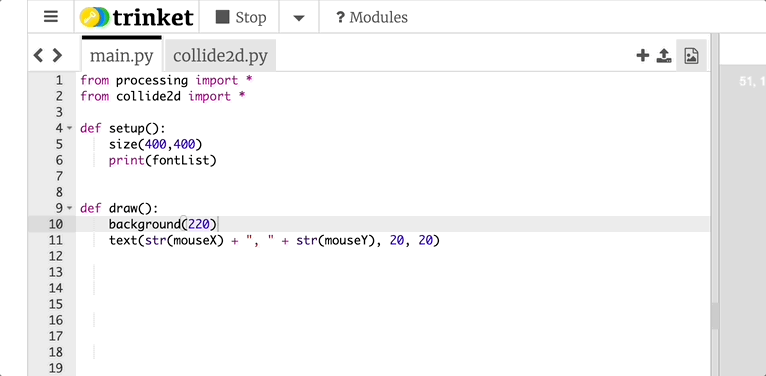

# U3LA3.1: Loading Images

### Teacher Notes and Overview

In this brief learning activity, students will learn to load images into their programs and display them on the canvas. This introduces a skill that many students will use for the rest of the year, and while the code itself is fairly low lift, the action of saving and using files can be a challenge. In the second half of the lesson, students will learn to adjust and manipulate their images.

Many students have limited experience with saving files locally. Anticipate needing to teach a lot of \[what you might think of as] basic skills, including naming conventions for files. Ideally, files should follow the same rules as variables - snake or camel case and no spaces.

Anticipate that students may also struggle with image file types - a common error is for students to accidentally save something that is not a compatible image (due to clicking the wrong option) and not realizing what they did. Because of this, we plan in time to discuss file types/extensions - this knowledge will be built onto in AP CSP, when students will also discuss lossy and lossless compression.

### Objectives

Students will be able to:

* Identify image file types to use in their program
* Use the processing.py library to load images
* Add images to their canvas, position, and resize
* Use tint to alter the appearance of an image
* Use a for loop to draw mulitple instances of an image

### Suggested Duration

2 class periods (\~90 minutes)

### NYS Standards

**9-12.CT.4** Implement a program using a combination of student-defined and third-party functions to organize the computation.

**9-12.DL.1** Type proficiently on a keyboard.

**9-12.DL.2** Communicate and work collaboratively with others using digital tools to support individual learning and contribute to the learning of others.

### Vocabulary

* **File type/extension** - the .EXT after a file determines how a computer interprets the data in the file. Common image file types: .gif, .jpeg, .png, .tiff, .svg
* **Background** - elements farthest away in the back of a scene
* **Foreground** - elements at the front of a scene&#x20;
* **Middle ground** - elements in the middle of a scene&#x20;
* **tint** - a colored overlay that adjusts the appearance of pictures. (think Instagram filters!)&#x20;

### Planning Notes and Materials

|                                                      Planning Notes                                                     |            Materials           |
| :---------------------------------------------------------------------------------------------------------------------: | :----------------------------: |
| _There are no specific planning notes for this lesson, but it is the first lesson students will be using media - whoo!_ | _No special materials needed._ |

### Resources

* [Finding, Naming, Saving Image Files](https://youtu.be/kr7KjcEm5zg) (Youtube Video)
* NEED VIDEO ON:
  * Adding and Displaying Images in p5.js
  * Uploading Media Files
  * Using Ting
* [Sample Forest Project](https://trinket.io/python/fafeaffad4) (Trinket)

### Assessments

**Formative**

* Collect student work on importing images&#x20;
* Exit Slip

**Summative**

* Mini Project: Vision Board&#x20;
* End of Unit Project: Meme Generator

### Do Now/Warm Up (3 - 5 minutes)

_Have students respond to the following prompt:_

List five things you think you know about computer photos and images.

_After students have had a chance to respond on their own, ask them to share out - they may talk about file types, or filters, or any number of things. Take ita ll in!_

### File Types & Finding Files (10 - 12 minutes)

Discuss the goals of this lesson:

1. Figure out how to find and save images to our computer
2. Learn to add images to our project
3. Code images to display on our canvas

Before students can continue with a code-along, first establish the basics of file types/extensions and their definitions. Then, introduce students to common types of image files:

|                   Common Image File Types                  |      Sound and Video File Types     |               Other File Types               |
| :--------------------------------------------------------: | :---------------------------------: | :------------------------------------------: |
| <p>.jpeg/.jpg<br>.png<br>.bmp<br>.tiff<br>.gif<br>.svg</p> | <p>.mp3<br>.mp4<br>.wav<br>.aac</p> | <p>.html<br>.pdf<br>.docx<br>.py<br>.web</p> |

**NB:** _If you're prepping students for an AP CS course, this would be a great time to sneak in the idea of lossy and lossless file types - but it's not necessary!_

Now, to add images into our program, we first need to find some images. Because we are making small, personal projects for the purpose of education, we will be using Google Images and won't be super concerned about the source of our images. **However, it is important for students to know that images may be subject to copyright protection and should always be properly credited in their code via code comments.**&#x20;

If you are so inclined, you may choose to teach students about [copyright](https://www.copyright.gov/what-is-copyright/), [fair use](https://www.copyright.gov/fair-use/more-info.html), digital licensing, and [creative commons licenses](https://creativecommons.org/licenses/). You can also have students pull from images that are under creative commons/fair use licenses using the following sites, but they can sometimes be limited in scope:

* [Creative Commons Image Search](https://wordpress.org/openverse/?referrer=creativecommons.org)
* [Creative Commons on Flickr](https://www.flickr.com/creativecommons/)
* [Smithsonian Open Access](https://www.si.edu/openaccess)
* Or try searching for 'open source', 'royalty free', or 'stock' photos and see what you can find!

But for now, to Google! There are two different ways that we can get images into our program:

1. We can **save the image locally and add the image file to our program**, which is a best practice to make sure the image is always right where we need it to be and we aren't making too many pull requests for an image that lives on someone else's server space.
2. We can **get the image URL**, which is where the image, in particular, lives on the internet, and use that to put the image in our program. This is a fine solution for our small, personal projects but not a great practice if we were making something bigger or commercial.

We are going to focus on #1 for now, but we will give an example of #2 later in the lesson. It's safe to assume that students have never (or rarely) been asked to save a file locally to their computer as they exist in the generation of the ☁️cloud☁️. Give students one minute (use a timer - it's easy for kids to go down a rabbit hole) one minute to find an image they like of some prompt you've given, like say, a dog. Then, walk them through these steps:

1. Create a new folder somewhere on your computer named after this class. Putting it on the desktop will make it easy to find later.
2. Right-click (this is a command-click or two-finger click if you're using a Mac) the image that you want to save.
3. Scroll down to 'Save Image As...'
4. Give the image a name you will remember. DO NOT use spaces or lead with a number - use the same rules we use for variables when naming images!

After students have saved their first image, show them that they have some control over the results from a google image search. If they click the **'Tools**' button (bottom right under the search bar when in Google Images) it will bring up several options. If they select '**Color --> Transparent**' they will be shown only images with a transparent background, which can be useful when adding to our program. (You can also search by usage rights using the Tools button - just select 'labeled for reuse.') Have students save two more images (preferably with transparent backgrounds) to practice.

Now, let's head to our program in Trinket. There's a button in the top right corner that looks like an image icon - we will be clicking on that! Please note that you should have named your image with a **usable file name** **prior to upload** as you **WILL NOT** be able to edit the file name once it's in the program.

<figure><figcaption><p>Gif of navigating from main.py to image library via right corner button</p></figcaption></figure>

Now, if we click `+ Image Library` in the corner, we will be able to add an image. Note that you need to upload the image and also click 'Done' to return to the main page of your image library where you will see your upload otherwise it will not officially have made it into your program.

<figure><figcaption></figcaption></figure>

**NB:** _This image shows uploading the same image twice, which is unnecessary - it was just made with limited images on hand!_

Once you've done one image together, ask students to load the other two in for practice. Circulate the room and make sure students can see their images now listed in the sidebar with the other files.

### loadImage() (10 - 12 minutes)

_**NB**: Your code will vary from the examples as you are finding and uploading your own sample image with students. As such, your file may not be called birch.png, and your image may not even be of a tree!_

In order to get your image to appear on the screen, it's important that the image first gets loaded into the program. This step _must_ happen in the `setup()` function as loading the image in `draw()` - which runs repeatedly forever - will significantly slow down the program.

Once you've uploaded your image to the image library, you'll work to recreate a version of the following code:

```python
from processing import *
from collide2d import *

def setup():
    size(400,400)
    global tree
    tree = loadImage("birch.png")
  

def draw():
    background(220)
    text(str(mouseX) + ", " + str(mouseY), 20, 20)

    

draw = draw
run()
```

Now, the image is loaded, but we will immediately notice that it's not actually displaying on our page. To make sure the image is drawn, we would need to add this to our page:

```python
from processing import *
from collide2d import *

def setup():
    size(400,400)
    global tree
    tree = loadImage("birch.png")
  

def draw():
    background(220)
    text(str(mouseX) + ", " + str(mouseY), 20, 20)
    
    image(tree, 0, 0, 100, 100)

    

draw = draw
run()
```

The **`image()`** function takes in five values - the variable holding an image, an x and y position, and a width and height, with the latter two being optional: **`image(x, y, [width], [height])`**

Once one image is working, encourage students to do the same for the rest of their images. They should aim to get \~6 images loaded into their program and displaying on their screen! As students work, watch for these common errors:

* **Make sure you've actually added the file to the program.** This seems self-explanatory, but things happen!
* **Spelling matters!** If something doesn't work, look to make sure the spelling is exact and the file types match. (Sometimes students go on autopilot and give everything a .jpg extension including things that do not have a .jpg extension.)
* **Watch for trailing spaces.** Sometimes students will name images with a space at the end of the name, which can throw a wrench in things. Watch for these if errors are occurring - this goes along with spelling matters!
* Make sure all indentation is correct for each function

If students are at a loss for what images to put in their program, consider making a scavenger hunt of items for them to find images of and go from there. Try to make the images topical, or related to student interests!

### Load an Image and Play with Position, Size and Tint (7 - 12 minutes)

_This will likely be the start of a new class period - you may want to begin by asking students the following:_

_You've just taken a picture that you want to share with the world. What are some things you might want to do to it before you post it on social media, or send it to friends/family?_

_After students share their ideas, relate some of these to computer science (adding text or mark up can easily be done in Processing.py!) and explain that the idea of "filters" relates to what they will learn today._

Remind students again how to load an image into their project, make sure it has a usable name, etc etc. Once the image is there, review position and size, which students saw in the first half of the lesson.

The new material for them involves applying `tint` to an image, which for our purposes we will think of like `fill` - but for images instead of drawn shapes. In that way, it's a bit like an image filter, which your students are probably very used to hearing about. The best way to explain it is to draw a lot of comparisons to filters they are familiar with from Instagram or other photo apps! The big difference here is that in Processing.py we have total control - so we can make overwhelming tints that essentially turn an entire image blue, or we can be subtle and just balance out the colors. Try to steer your students towards the latter (unless they want to read about brutalism and make some intense and purposeful design decisions).\
\
Tint is based on what color mode you are in - HSB or RGB - and will look like this (alpha being an optional 4th value like in fill): **`tint(v1, v2, v3, [alpha])`**

In this activity, we are going to play with our image a bit. Just for fun, go find an image of some creature you find in nature - try to find one with a transparent background (most likely this will be a png file). When searching from Google Images, click Tools after your search, then click Colors -> Transparent to filter for images with a transparent background.

Once you load your image, it should look something like this:

_**NB**: Your code will vary from the examples as you are finding and uploading your own sample image with students. As such, your file may not be called birch.png, and your image may not even be of a tree!_

```python
from processing import *
from collide2d import *

def setup():
    size(400,400)
    colorMode(HSB)
    
    global tree
    tree = loadImage("birch.png")
  

def draw():
    background(220)
    text(str(mouseX) + ", " + str(mouseY), 20, 20)
    
    tint(180,70,60)
    image(tree, 0, 0, 100, 200)

    

draw = draw
run()
```

When we change tint with high saturation and brightness, the results can be very overwhelming - however, if we are more subtle in our adjustments, they can work like Instagram filters and make images look better, or go better together. Give a little time for students to experiment in both color modes and with a variety of numbers!

### An Experiment in Opacity

Let’s add another tree, and with this one, adjust the opacity. What do you notice?

```python
from processing import *
from collide2d import *

def setup():
    size(400,400)
    colorMode(HSB)
    
    global tree
    tree = loadImage("birch.png")
  

def draw():
    background(220)
    text(str(mouseX) + ", " + str(mouseY), 20, 20)
    
    tint(180,70,60)
    image(tree, 0, 0, 100, 200)
    
    tint(180,70,60, 0.3)
    image(tree, 250, 350, 100, 200)

    

draw = draw
run()
```

### Using Tint to Create Depth (5-10 minutes)

Let's take a pause for a moment to discuss a little color theory; move away from the editor for just a moment so we can talk about how tint (and colors in general) can be used to create depth in a 2D design.\
\
From an art perspective, any scene you create has a foreground, a middle ground, and a background. Check out this classical example to understand each one:

<figure><figcaption><p>Image of a bucolic oil painting with background, middle ground, and foreground labeled.</p></figcaption></figure>

Generally, the **foreground has the warmest, most saturated colors**, because you are supposed to feel that it is close. **Warm colors** tend to be **reds** and **oranges**, but sometimes we see this effect with other colors that are just very saturated. The **middle ground** **has colors somewhere in the middle, while the background has the coolest, least saturated colors**. **Cool colors** are generally **blues, purples, and greens**, but this effect can be achieved with any unsaturated color. While it’s not true in this example, sometimes the background might be darker, as well, depending on the scene that is being created.

**If you are interested in doing a deep dive into art/design/color theory**, you could turn a good 20-40 minutes into just exploring this idea with colored paper cutouts and having students make a design with a defined fore/middle/background - but that is way above and beyond and not totally necessary to complete this project

### Create a Forest Scene (7-10 min)

As a pair programming activity or on their own, have students find an image of a tree (or several trees) with a transparent background. Using several for loops, create ‘rows’ of trees to create a forest scene. Give each row a unique tint so that it creates the illusion of having a foreground, middle ground, and background.

**NB:** _Students could absolutely do this without for loops, but it would be a much less efficient way of solving this problem and would probably take a long time. If you have students who go this route (because combining the for loop and image skill may be confusing), be sure to talk about it with them (and the class, if necessary) to get more buy-in using a for loop._

_**Please view the sample project if you need guidance on the output!**_

### Wrap Up (5 min)

Students can submit their project as a formative assessment if you’d like, or answer one of the following questions as an exit slip:

1. What is the purpose of the preload() function?&#x20;
2. Describe the steps needed to upload an image and get it to display on your canvas.&#x20;
3. What are common file types for images? Which file type(s) did you use in today's project?

### Extensions

For students who are racing ahead, there is no particular extension for this assignment. There isn’t much ‘more challenging’ about uploading images. It is recommended to have them start trying to create compositions with images, or have them start searching for images with transparent backgrounds to explore layering, rather than having them move on to new skills.

You can also have students do a quick little Google exploration for websites that will remove background from images, which is a great tool to be aware of for when they can't find the image they want with a transparent background already!

**Can you add the following to your project?**

* Add multiple tree images to a list, and select a random tree to draw each time.&#x20;
* Hide several creatures within your forest - play with opacity if you want them to be super camouflaged!&#x20;
* Increase the brightness of the tint on a row of trees if it is clicked on
