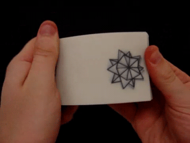

# U4LA1.1: Intro to Motion with Flipbooks

### Overview && Teacher Feedback

In this learning activity, we create an animation of a ball moving to the right. We start by doing this on paper, drawing on the corners of a notebook and flipping its pages. We re-create the animation in Processing.py and then look into changing the speed of the flipping motion.

This lesson can be as quick or as long as you would like it to be, depending on if you break for an unplugged craft activity or not. Use your discretion! This lesson is also 'chunked' away from other motion topics solely for time purposes - feel free to combine with the next lesson as you see fit.

### Objectives

Students will be able to:

* Animate an ellipse in one direction&#x20;
* Understand the different methods to speed up or slow down the movement of a visual element

### Suggested Duration

1 period (45 minutes) _Unless you choose to do an unplugged activity of having students make flip-books_, _in which case budget for more time!_

### NYS Standards

**9-12.CT.4** Implement a program using a combination of student-defined and third-party functions to organize the computation.

**9-12.CT.7** Design or remix a program that utilizes a data structure to maintain changes to related pieces of data.

**9-12.DL.1** Type proficiently on a keyboard.

**9-12.DL.2** Communicate and work collaboratively with others using digital tools to support individual learning and contribute to the learning of others.

### Vocabulary

* **Flipbook** - a series of illustrations of an animated scene bound together in sequence so that an illusion of movement can be imparted by flipping them rapidly
* &#x20;**Frame** - in film-making, it refers to a single image, the smallest compositional unit of a film's structure, captured by the camera on a strip of motion picture film.&#x20;
* **Tweens** - the frames between major frames in animation that create the illusion of movement.&#x20;
* **Frame rate (also frames per second or fps)** - In motion pictures television and in computer video displays the frame rate is the number of frames or images that are projected or displayed per second.&#x20;
* **`frameRate()` function** - Specifies the number of frames to be displayed every second. The default frame rate is set to 60 fps on most computers.

### Resources

* [How to Make A Flipbook](https://drive.google.com/open?id=1JOlmOdTCsy0Ouezf1Hnw6T6f12MBsaL8) (Video)&#x20;
* [Flipbooks Made As a Kid](https://drive.google.com/open?id=1Zc7BBCAhqqH1t85XviulDBnKKsqLG3V-) (Video)
* NEED CODING VIDEOS FOR PYTHON

### Assessments

**Formative:**

* Code Along Performance
* Carnival Horse Challenge

**Summative:**

* Upcoming mini project
* Upcoming End of Unit Project

### Do Now/Warm Up (3-5 minutes)

_This activity can either be done in student notebooks if they choose to use them or on small stacks of cut post-its/notecards. Please use your best judgement and pass out any necessary materials at the beginning of class!_

In the lower right-hand corner of your notebook/paper stack, we are going to create a moving ball animation. Start on the first page by drawing a ball. Then, on the next page, draw it in a slightly different position. Then a different position again on the next one. Do this for as many pages as you can until the time is called.

### Move a Ball Towards the Right (5 - 10 minutes)

**NB:** _If you need a little code break, you can consider introducing this lesson and then pausing to have students make a more fully realized flipbook, just to get the fun creative juices flowing._&#x20;

_If you are choosing to have students make more fully realized flipbooks, showing the videos and then pausing before code to allow them to create is a great stopping point. They can pick back up with the x+1 idea once they’re done._

When we watch a movie, what we are really seeing is a series of still images flipping very fast. The illusion of motion is created in the same way as in a paper [flipbook](https://en.wikipedia.org/wiki/Flip\_book):

<figure><figcaption><p>Animation of a dancing candy corn flipbook</p></figcaption></figure>

Let's think about how the illusion is created with just pen and paper. During the do now, using the corners of your notebook, you created the illusion of a small ball moving to the right. On the first page, drew a little ball. On the next, you drew it slightly to the right. On the next, more to the right, and so on. Now, if you flip the pages, you can see the ball move.

<figure><figcaption><p>Image of shape spinning in flipbook</p></figcaption></figure>

### Creating Motion in p5.js (12 - 15 minutes)

In Processing.py, each time the draw loop runs, it draws an image. Our sketches are like digital flipbooks: each image rendered by draw is like a new page in the book.&#x20;

When Processing.py runs, it calls draw, again and again, drawing image after image, as if it were flipping the pages of a book. Each 'page' Processing.py draws is called a frame.&#x20;

If Processing.py acts like a flipbook, this means we can create animations with it. Let's re-create the moving-ball illusion in Processing.py. We will do it in the same way as you just did on your notebook: start by drawing the ball on the left of the canvas, then draw it slightly to the right, then slightly more to the right, and so on.

<figure><figcaption><p>Animation of ball moving from left to right across screen</p></figcaption></figure>

From frame to frame (which is to say, each time draw runs), the only thing that changes is the x position of the ball. We want it to vary. So let's start by creating a variable and calling it x (line 1). In setup, we assign x to 0, so that the ball starts from the left edge of the screen (line 5). Then, in draw, we add 1 to that position (line 10). As draw is called by Processing.py over and over again, the value of x will increase:

* In the first frame, x is 0&#x20;
* In the second frame, x will be 1.&#x20;
* In third, x will be 2&#x20;
* ...and so on: in frame 500, for example, x will be 499

The value of our x variable will continue to increase with each frame until the sketch stops running. In fact, at some point x will become larger than the width of our canvas, and we won't see our ball anymore.

Let's figure out this code will look. A basic version might be like this:

```python
from processing import *
from collide2d import *

x = 0 #start on left side of canvas

def setup():
    size(510,350)

def draw():
    background(220)
    text(str(mouseX) + ", " + str(mouseY), 20, 20)
    
    ellipse(x, 50, 20, 20)
    x += 1 #Move slightly to right - could also be x = x + 1
    
    
    
    
draw = draw
run()
```

However, there are going to be a lot of qualities of this moving ball we may want to change eventually, so let's exercise good programming practices and set this variable as part of an object literal:

```python
from processing import *
from collide2d import *

circ1 = {
  "x":0,
}

def setup():
    size(510,350)

def draw():
    background(220)
    text(str(mouseX) + ", " + str(mouseY), 20, 20)
    
    ellipse(circ1["x"], 50, 20, 20)
    circ1["x"] += 1 #Move slightly to right - could also be x = x + 1
    
    
    
    
draw = draw
run()
```

Notice that right now, we are adding 1 to the x position of our ellipse. What would happen if we changed that number? Give students a minute or two to experiment making the number bigger/smaller. When they come back together, ask them: if we had to give a name to what 1 is in our program right now, what might we call it? What does it control?

Students should land on this idea of 'speed.' This is a great idea, and one we can use to simplify our program. So let's add this in:

```python
from processing import *
from collide2d import *

circ1 = {
  "x":0,
  "xSpeed": 1,
}

def setup():
    size(510,350)

def draw():
    background(220)
    text(str(mouseX) + ", " + str(mouseY), 20, 20)
    
    ellipse(circ1["x"], 50, 20, 20)
    circ1["x"] += circ1["xSpeed"] #Move slightly to right
    

draw = draw
run()
```

### \[OPTIONAL] Change Speed with Frame Rate

**NB:** _Frame rate is touched on in other lessons. It's useful to know about, but perhaps not always the best way to control speed given that it affects the entire canvas, rather than ust a single section. Use as much or as little of this knowledge as you need to meet the needs of your learners!_

We also have another way that we can control speed while leaving that 1 just as it is!&#x20;

Just like we can flip paper books faster or slower, can run our draw loop faster or slower: we can draw only 5 frames per second; we can draw 50 frames per second. This speed is called the frame rate. In cinema, the typical rate is 24fps (fps stands for 'frames per second'). To create smooth motion, Processing.py tries to run the code inside `draw()` at 60 frames each second. This what is called the frame rate.&#x20;

To see the rate Processing.py is running at, we can call the frameRate function. Paste this code on the editor and take a look at the console:

```python
def draw():
    fr = frameRate()
    print(fr)
```

Usually, we just let Processing.py run with its default `frameRate`. However, it is possible to change it: the `frameRate` function can also be used to set the rate we want Processing.py to run at. You can use the `frameRate` function in setup to increase or decrease the number of frames displayed per second.

`frameRate(2)` tells Processing.py to draw a maximum of 2 frames per second. Below, we add this line to our moving ball example:

```python
from processing import *
from collide2d import *

circ1 = {
  "x":0,
  "xSpeed": 1,
}

def setup():
    size(510,350)
    frameRate(2)

def draw():
    background(220)
    text(str(mouseX) + ", " + str(mouseY), 20, 20)
    
    ellipse(circ1["x"], 50, 20, 20)
    circ1["x"] += circ1["xSpeed"] #Move slightly to right
    

draw = draw
run()
```

As you can see, at 2fps the illusion of motion is broken: we don't see a ball in smooth motion but a ball skipping from one position to the next. The illusion of motion starts happening at around 12fps but is smoother at 24fps and higher.&#x20;

Try setting the frame rate to different values and see the difference. This can also be useful as a debugging tool to make console output easier to read.

### Resetting by Position (5- 10 minutes)

As you've noticed, eventually our ball makes it to the edge of the screen and then disappears. What if we wanted it to reset back to the start? We can use conditional logic to handle this:

```python
from processing import *
from collide2d import *

circ1 = {
  "x":0,
  "xSpeed": 1,
}

def setup():
    size(510,350)

def draw():
    background(220)
    text(str(mouseX) + ", " + str(mouseY), 20, 20)
    
    ellipse(circ1["x"], 50, 20, 20)
    circ1["x"] += circ1["xSpeed"] #Move slightly to right
    
    if circ1["x"] > width:
        circ1["x"] = 0
    

draw = draw
run()
```

In the example above, the circle would reset to the beginning each time it passes the far edge of the canvas. We could make other things happen in this conditional, as well - we could adjust the speed, or other aspects of the circle, or even trigger other things unrelated to the circle to happen in our program.

### Student Exercise: Animate Multiple Shapes (10 - 15 minutes)

<figure><figcaption><p>Image of carnival horse racing game</p></figcaption></figure>

Old school carnivals have racing games where players have to hit targets or roll balls into holes to move their player - often a horse - forward to the other side. Because of the various skill levels of different people playing, the horses all travel at different speeds.

Create a vertical line of circles that will all travel left to right across the screen. Each will need their own object literal to hold their individual x-position and speed; use random() to give them each a random speed so they can race!

### Wrap-Up (\~5 minutes)

This is a great time to have students share what they have done for the main exercise and demonstrate their code to the class! Try to have 2-4 students at varying levels share what they created, any questions they’ve had, etc.&#x20;

You can also have students submit their work via Google form for grading.

### Extensions

Modify the main exercise by asking students to do the following:

* In the object literal, give each circle a name attribute.
* Display the name of the winner on the canvas.
* Animate an imported image
* Create conditions so that some shapes just stop before reaching the end of the canvas (maybe that person abandoned the racing game! Consider making the place they stop random, while always having a chance to finish.)
* Program one shape so the player can animate it with a click or button!
