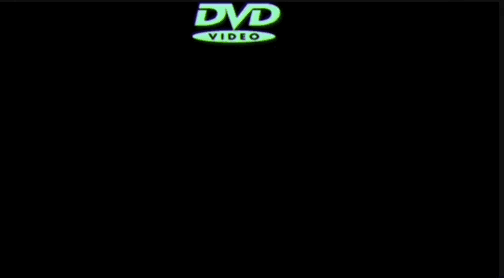

# U4LA1.2: Move in All Directions and Make it Bounce

### Overview && Teacher Feedback

In this learning activity, we create and animate an ellipse moving in multiple directions.&#x20;

This lesson builds off of the basics in U4LA1.1 as a natural extension - it can be easily combined with that lesson for students who work faster. In the latter half of the lesson, students will learn how to make animations 'bounce' and will work to create a floating DVD logo as their student practice.

### Objectives

Students will be able to:

* Understand the different methods to speed up or slow down the movement of a visual element&#x20;
* Understand and use assignment operators&#x20;
* Move objects backward and diagonally&#x20;
* Move objects to random positions&#x20;
* Have objects bounce when they reach the edge of the canvas

### Suggested Duration

2-3 Days (45 - 90 minutes) _Depending on pacing of your class - you can easily do more practice with basic motion before making things bounce!_

### NYS Standards

**9-12.CT.4** Implement a program using a combination of student-defined and third-party functions to organize the computation.

**9-12.CT.8** Develop a program that effectively uses control structures in order to create a computer program for practical intent, personal expression, or to address a societal issue.

**9-12.DL.1** Type proficiently on a keyboard.

**9-12.DL.2** Communicate and work collaboratively with others using digital tools to support individual learning and contribute to the learning of others.

### Vocabulary

* **Arithmetic operators** - This operator performs arithmetic between variables and/or values.&#x20;
* **Assignment operators** - This type of operator is used to assign values to JavaScript variables.

### Resources

* NEED VIDEO ON BOUNCE IN PYTHON

### Assessments

**Formative:**

**Summative:**

### Do Now/Warm-Up (\~5 minutes)

Let's try something different: We want to make something move, but we want it to move in a different direction that what we did in the last lesson.

Create an ellipse that exists on the right side of your canvas. How could you animate this ellipse so that it moves from the right to the left (vs left to right like in the last lesson)?

### Motion Review (\~3 - 5 minutes)

In the Do Now, students should have created something like the following code. Review this with them and ensure everyone is on the same page of using object literals, which will come in handy later:

```python
from processing import *
from collide2d import *

circ1 = {
  "x":380,
  "xSpd":3,
}

def setup():
    size(510,350)

def draw():
    background(220)
    text(str(mouseX) + ", " + str(mouseY), 20, 20)
    
    ellipse(circ1["x"], 200, 20, 20)
    
    circ1["x"] = circ1["x"] - circ1["xSpd"]
    
    
draw = draw
run()
```

It's worth noting that some students may have made the speed a negative number and added it on line 16, and it's always good to reiterate that adding a negative is the same as subtracting a positive. This is also a good moment to review with students the **arithmetic operators**: if your students have been typing `x = x + xSpd`, they can shorten by writing `x += xSpd`, which means the same thing.

In fact, there are many **arithmetic operators** beyond just addition:

* `x = x + 1` can be written as `x += 1`&#x20;
* `x = x - 1` can be written as `x -= 1`&#x20;
* `x = x * 1` can be written as `x *= 1`&#x20;
* `x = x / 1` can be written as `x /= 1`

Make sure students understand that these aren't _more right,_ but they are generally considered more efficient as it's less to type, and they may see these in future code examples. (Although they can certainly choose which version they'd like to write in their own code based on what they are comfortable with!)

### Moving Vertically (\~5 minutes)

So, taking what we learned, can we make a second circle that moves up and down instead of left or right? Give students \~3-5 minutes to try to create this in their own programs, and then review the code together (possibly by asking students to present). They should've added another circle like so:

```python
from processing import *
from collide2d import *

circ1 = {
  "x":380,
  "xSpd":3,
}

circ2 = {
  "y":50,
  "ySpd": 2,
}

def setup():
    size(510,350)

def draw():
    background(220)
    text(str(mouseX) + ", " + str(mouseY), 20, 20)
    
    ellipse(circ1["x"], 200, 20, 20) #circ1 moves right to left
    ellipse(200, circ2["y"], 20, 20) #circ2 moves from top to bottom
    
    circ1["x"] = circ1["x"] - circ1["xSpd"] #moves circ1
    circ2["y"] += circ2["ySpd"] #moves circ2
    
    
draw = draw
run()
```

Now we should have two circles, one that moves up and down, and one that moves left and right. What if we wanted a shape to move diagonally? How could we make that happen?

### Move Diagonally (\~5 -10 minutes)

When something moves diagonally, it means that it is changing both its x and y position. So let's add a third ellipse in our program that will do just that! Take a pulse check of students - if they have ideas of how this would look, let them try for \~3-5 minutes before reviewing. Students who are not as confident in their algebra skills may need a little more walkthrough.

```python
from processing import *
from collide2d import *

circ1 = {
  "x":380,
  "xSpd":3,
}

circ2 = {
  "y":50,
  "ySpd": 2,
}

circ3 = {
  "x": 20,
  "y": 20,
  "xSpd":3,
  "ySpd":1,
}

def setup():
    size(510,350)

def draw():
    background(220)
    text(str(mouseX) + ", " + str(mouseY), 20, 20)
    
    ellipse(circ1["x"], 200, 20, 20) #circ1 moves right to left
    ellipse(200, circ2["y"], 20, 20) #circ2 moves from top to bottom
    ellipse(circ3["x"], circ3["y"], 20, 20) #circ3 moves diagonally
    
    circ1["x"] = circ1["x"] - circ1["xSpd"] #moves circ1
    circ2["y"] += circ2["ySpd"] #moves circ2
    
    circ3["x"] += circ3["xSpd"] #moves circ3 x axis
    circ3["y"] += circ3["ySpd"] #moves circ3 y axis
    
    
    
    
draw = draw
run()
```

With students, adjust the x and y speed so they can see how changing these values (essentially, the 'slope' of the line ellipse is animating in) changes the way it moves.

### \[OPTIONAL] Move at Random (10 - 15 minutes)

**NB:** _This is a little bit of a different functionality than the other motions - you're welcome to teach it now, or after the bounce section, or skip it entirely. (You can also teach in a pull-group or as a future extension.) It's not necessarily \_difficult\_ it may just detract from some of the pieces happening earlier in the lesson that are more aligned with the 'make it bounce' section._

Alright, we have one final piece of motion to tackle, and then we are going to review how to make these shapes stay on the page. What if you want to make a shape that moves randomly? Time to add our fourth circle! Since it requires a Processing.py function, we will give those speeds values in our setup.

```
from processing import *
from collide2d import *

circ1 = {
  "x":380,
  "xSpd":3,
}

circ2 = {
  "y":50,
  "ySpd": 2,
}

circ3 = {
  "x": 20,
  "y": 20,
  "xSpd":3,
  "ySpd":1,
}

circ4 = {
  "x":200,
  "y":200,
  "xSpd": 0,
  "ySpd": 0,
}

def setup():
    size(510,350)
    circ4["xSpd"] = random(-3,3)
    circ4["ySpd"] = random(-3,3)

def draw():
    background(220)
    text(str(mouseX) + ", " + str(mouseY), 20, 20)
    
    ellipse(circ1["x"], 200, 20, 20) #circ1 moves right to left
    ellipse(200, circ2["y"], 20, 20) #circ2 moves from top to bottom
    ellipse(circ3["x"], circ3["y"], 20, 20) #circ3 moves diagonally
    ellipse(circ4["x"], circ4["y"], 20, 20) #cic 4 moves randomlly
    
    circ1["x"] = circ1["x"] - circ1["xSpd"] #moves circ1
    circ2["y"] += circ2["ySpd"] #moves circ2
    
    circ3["x"] += circ3["xSpd"] #moves circ3 x axis
    circ3["y"] += circ3["ySpd"] #moves circ3 y axis
    
    circ4["x"] += circ4["xSpd"] #moves circ4 x axis
    circ4["y"] += circ4["ySpd"] #moves circ4 y axis
    circ4["xSpd"] = random(-3,3) #choose new speed for next frame
    circ4["ySpd"] = random(-3,3) #choose new speed for next frame
    
    
    
    
draw = draw
run()
```

Note that because this shape is picking from negative and positive speeds, it will move in any direction and the speed/rate at which it moves is entirely up to the random nature of the program. (Try removing the background to watch this random walker make a fun design!)

### Make it Bounce (10 - 15 minutes)

In the last lesson, we talked about how we can get our shapes to reset to the edge they started on using conditionals. But what if rather than reset, we want the shape to 'bounce?' (Here, we consider 'bouncing' to be reversing and going in the other direction.)

Let's think about how we could make that happen - this time, instead of changing the x or y position to 0, we just want it to _reverse direction._ How could we solve this? Give students \~3 minutes to think this through before you begin reviewing. Anticipate that most students will have an idea similar to the following:

```python
if circ1["x"] > 400:
    circ1["x"] -= circ1["xSpd"]
else:
    circ1["x"] += circ1["xSpd"]
```

This solution is a good thought, but it ultimately will not work. You can use `print()` to show exactly why - as soon as the x position is bigger than 400, it wil start subtracting, but once it's no longer bigger than 400, it will start adding, resulting in the circle getting stuck unable to move in either direction.

Rather than using an if/else, we just want to use an if that will change the direction of the motion. One thing we learned from the Do Now is that direction is controlled by our speed being negative or positive - so when we reach the edge, we want to take the opposite speed. If we think back to our math knowledge, we can recall that we get a number's opposite when we multiply it by -1. So our code could look like this:

```python
#Same code as before, but we've condensed here for readability:

from processing import *
from collide2d import *

circ1 = {
  "x":380,
  "xSpd":3,
}

def setup():
    size(510,350)

def draw():
    background(220)
    text(str(mouseX) + ", " + str(mouseY), 20, 20)
    
    ellipse(circ1["x"], 200, 20, 20) #circ1
    
    if circ1["x"] < 0:
        circ1["xSpd"] *= -1
    
    circ1["x"] -= circ1["xSpd"] #moves circ1 horizontally
    
    
draw = draw
run()

```

Now, this should bounce when the ellipse reached the far right side of the screen. Cool! But what if we want it to both off both sides? We can simply modify the if statement:

```python
if circ1["x"] < 0 or circ1["x"] > 400:
    circ1["xSpd"] *= -1
```

Ask students to create a conditional (or several) that will work for circle 2 and then circle 3 - this can be challenging with the diagonal, but they can do it! After allowing 5-10 minutes of work time, review with students.

### \[OPTIONAL] Student Practice/Challenge (\~15 Minutes)

You’ve been asked to create an animated simulation of cars traveling through a busy intersection in NYC.

Take your previous exercise from lesson #1 and modify it so that you have simple shapes (simulating cars) that move in multiple directions and with different speeds.

You should have at least one of each:

* Left / right&#x20;
* Down / up&#x20;
* Diagonally&#x20;
* Random speed or fixed speed
* Make multiple shapes reset or bounce as they reach the end of their 'route'

Here’s a painting by Dutch-born artist Piet Mondrian from 1942 called “Broadway Boogie Woogie”. This painting is inspired by clear real-world examples: the city grid of Manhattan, and the Broadway boogie-woogie, a type of music Mondrian loved.

<figure><figcaption><p>Broadway Boogie Woogie by Piet Mondrian</p></figcaption></figure>

How could you use colors, shapes, and animation techniques to code a sketch that creatively simulates a busy intersection?

### Student Challenge: Floating DVD Logo (25 - 45 minutes)

If you’ve ever let a device sit idle while it’s plugged into something like a laptop, DVD/Blu-ray player, game console, or even watched a Smartboard, you’ve noticed that the people behind those hardware systems have made a ‘default screen’ to display when nothing is happening. Sometimes, this is just a static logo - but in the best versions, it is a logo that moves around the screen. This can be pretty enjoyable to watch, and pretty distracting, as you can see from [this example](https://www.youtube.com/watch?v=QOtuX0jL85Y).

Using what you know about animation, you are going to create a simple DVD screensaver (or any device really) with a logo to send bouncing around the screen.

<figure><figcaption><p>Bouncing DVD Logo on Black Screen</p></figcaption></figure>

Your project should have and do the following:

* Have a basic logo made of several p5 shapes, or multiple images, or multiple lines of text, or a mix of all three. It should not be just a single shape/image/text line!&#x20;
* When you hit play, the shape should begin moving around the screen.
* &#x20;If the shape gets to an edge, it should bounce back and travel in a different direction. (It can absolutely change speed when it picks this new direction!)

### Wrap Up (3 - 5 min)

The most important part of this lesson is leaving with a solid understanding of the logic it takes to get a shape to bounce off the edge of the canvas, as this is necessary for the next mini project.&#x20;

You can review that logic as the wrap up.

### Extensions

Since we are on a computer and not just a TV monitor or smartboard, let’s make this more interactive!

* Make your logo interact with the mouse - when the mouse touches the logo, it should change directions.&#x20;
* Alternately, see if you can figure out if you can get the logo to ‘chase’ the mouse!&#x20;
* You can also try to make something other than direction change with your shape!
