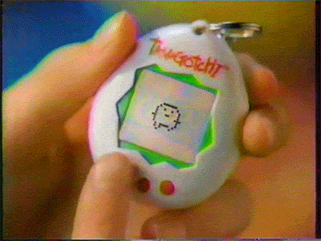
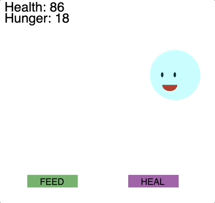

# 🗃 U4LA2 Mini Project: Build a Tamagotchi

### Overview && Teacher Feedback

Before students advance to making many objects on a canvas, we want them to practice making a Class that will generate a single object but have many properties and methods. Intro: the Tamagotchi!

The most basic version of this project does not requier anything extra, although some students may benefit from learning about modulos. If you'd like to up to the ante, consider teaching the lesson on timers before this project so that students can have needs decrease based on time.

### Prompt

<figure><figcaption>
Tamagotchi
</figcaption></figure>

One of the biggest toy fads of the mid '90s to early '00s was the [Tamagotchi](https://en.wikipedia.org/wiki/Tamagotchi) ([commercial 1](https://youtu.be/DAahOV63\_wA) | [commercial 2](https://youtu.be/G-dnRcAekBU)). As kids may need more context, consider this [4 minute 90s rewind on digital pets](https://youtu.be/teNYpJ32stY). This was a little virtual pet that lived on a small piece of hardware attached to the keychain. When users turned it on, the pet would begin as an egg, and using simple buttons you would care for it's needs (feeding it, playing with it, training it, etc) which changed in real time. Early versions did not have a pause button, making it _very stressful_ to keep a Tamagotchi alive.

<figure><figcaption>
Tamagotchi gif with person feeding it a meal
</figcaption></figure>

In this project, you'll be making your own computer-based version of the Tamagotchi! The end result will be a little character that moves around the screen, bouncing off edges, that you can interact with.

**Requirements:**

1. Create a digital pet Class (named whatever you want) that has all properties and methods related to your virtual pet. You will be creating a single object instance of this pet.
   * [ ] In addition to the usual properties like x/y/size/color etc, you must include **health** and **hunger** properties that have default starting values. (You may also include other things to track your Tamagotchi, like level, experience, age, etc.)
2. Design your digital pet - make a `display()` method so it displays on the screen.
3. Create methods to move your pet around the screen and ensure it bounces on the edges or is otherwise unable to leave the screen.
4. While moving, the pet should get **hungrier** every few 'steps' - the **hunger** property should change accordingly.
5. When the pet bumps into an edge, the **health** should decrease.
6. Adjust the `display` method so that the digital pet has a different look if it becomes **too hungry** or **too unhealthy.** (You can also make a 😵 version if both are true.)
7. Create a method that will allow you to feed your pet by interacting via clicks or keys.
8. Create a method that will allow you to heal your pet by interacting via clicks or keys.

### Suggested Duration

\~3 - 5 Periods. _An easy way to shorten this project is to have students use images to make their pets rather than coding their own design - then the focus can be on the newer and more algorithmic skills._

### Sample Output

<figure><figcaption>
Sample project with bouncing pet and buttons to feed and heal
</figcaption></figure>

[Sample Code](https://trinket.io/library/trinkets/3bdbb446e5)

### Extensions

There are _so_ many ways to extend this project:

* Learn about and utilize modulos in your program
* Give the Tamagotchi more properties that control different thins about it. (An easy one is **age**, and have the Tamagotchi 'grow up' over time.)
* Give the project a very 90s look
* Tamagotchi meet Pokémon: think about attributes like HP, attack, defense, etc and make a pet that can train and battle
