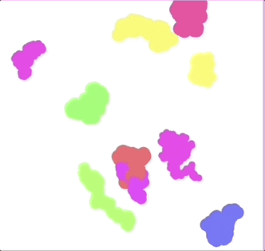

# U4LA2.4: Objects on Canvas

### Teacher Notes and Overview

This lesson pulls together everything students have been learning about Classes and objects and brings it back to the canvas. Students may notice that building a Class and the associated methods may be a big initial lift, but the goal is that once it's made, it will be easier to make duplicates on their screen and minimize the amount of repeated and confusing code.

This is a great time to get students used to splitting their code across multiple files that are all linked together; storing Classes in their own location (as we did with functions) can help make our code easier to read and manage, and can be empowering to students.

### Objectives

Students will be able to:

* Create a Class with properties and methods related to the Processing.py library
* Create instances of the Class
* Use methods to change their object on the canvas

### Suggested Duration

1-2 Periods (45 - 90 minutes)

### NYS Standards

**9-12.CT.4** Implement a program using a combination of student-defined and third-party functions to organize the computation.

**9-12.DL.1** Type proficiently on a keyboard.

**9-12.DL.2** Communicate and work collaboratively with others using digital tools to support individual learning and contribute to the learning of others.

### Vocabulary

_No new vocabulary is introduced_

### Planning Notes and Materials

|                                                                         Planning Notes                                                                         |           Materials          |
| :------------------------------------------------------------------------------------------------------------------------------------------------------------: | :--------------------------: |
| Make decisions in advance about how you would like students to organize their code - it can be very empowering to start splitting code across different files! | No specific materials needed |

### Resources

[Blank Editor w/ Collide 2D Linked](https://trinket.io/python/e683494caa) (Trinket)

### Assessments

\
**Formative:**

* Improved Wiggler

**Summative:**

* Upcoming Tamagotchi Mini Project
* Upcoming End of Unit Final

### Do Now/Warm Up (\~2-3 min)

Think back to the beginning of this unit when we were learning about motion, before we dove into Classes and objects. Briefly summarize the process of making something on the canvas move around the screen.

### Setting up for Objects that Move (\~5 min)

Take time to review the do now with your students, as it's been awhile since they worked with motion. Make sure they get the basics of creating speeds that will change the x and y position of a shape.

Then, explain that you are going to be creating a Wiggler class today. This object will 'wiggle' it's way across the screen and should bounce when it encounters edges. To make things fun, we can get rid of the background to track its progress. If we made several, it might look something like this:

<figure><figcaption><p>Multiple wigglers on the screen</p></figcaption></figure>

You may want to spend some time with students previewing what they think will need to happen to create these, such as generating random speeds, etc. Once you feel like they have a clear vision of where the lesson is headed, it's time to start coding!

### Code Along: Create a Wiggler (15 - 25 min)

Ask students to create a new sketch with Collide2D linked. We won't be using collision right away, but they may want it later!

To start out, we are going to make a Class and slowly add our methods. You can instruct students to do this in their main file, or to create a separate .py file that they will import at the top of their code. This will help them stay more organized.

**NB:** _In Python, Classes must be created or imported before - meaning above - wherever you are trying to make a new instance. If you choose to keep everything in one file, consider marking where the Classes definitions vs. main sketch start with comments._

_If you choose to make a different file, you will need to `from process.py import *` at the top of the file to be able to use Processing.py functions in your Class._

Begin by thinking of the very basics of this wiggler: we know it will need to be a shape, and we know it needs to move. For our purposes, let's make that shape a rectangle. We know a rectangle has an x, y, width, and height and that it will need an `xSpd` and `ySpd` to move. We will also need to decide which of those we want to set manually, and which are default values. You can discuss with your class or decide unilaterally - based on their choices, the Class may look different, but you will end up with something that looks like:

```python
class Wiggler:
    def __init__(self, w, h):
        self.x = random(width) #will appear anywhere on canvas
        self.y = random(height) #will appear anywhere on canvas
        self.w = w
        self.h = h
        self.xSpd = random(-3, 3) #create random movement
        self.ySpd = random(-3,3) #create random movement
```

Perfect - so let's make a new Wiggler!

```python
def setup():
    size(510,350)
    global wiggler1 #global because we will use it in draw later!
    wiggler1 = Wiggler(35, 35)
   

def draw():
    background(220)
    text(str(mouseX) + ", " + str(mouseY), 20, 20)

    
draw = draw
run()
```

Our code looks right, but if we hit play, nothing is showing up on the screen. We may wonder: did it even make our object? We can test by using a good ol' `print()` as we were in past lessons and sure enough, our object should be there. But it's not appearing on screen! That's because while we have set all our properties and given all this information to draw our moving rectangle, we haven't actually told the computer that we _expect it to make a moving rectangle._

That's where our methods are going to come in! The first method we need is one to get a rectangle to appear on the screen. Let's set it up like so:

```python
class Wiggler:
    def __init__(self, w, h):
        self.x = random(width) #will appear anywhere on canvas
        self.y = random(height) #will appear anywhere on canvas
        self.w = w
        self.h = h
        self.xSpd = random(-3, 3) #create random movement
        self.ySpd = random(-3,3) #create random movement
    
    def display(self):
        rect(self.x, self.y, self.w, self.h)
```

This is really simple, but students can return to style their wigglers later. We have to make sure we don't just write our method but also call it:

```python
def setup():
    size(510,350)
    global wiggler1 #global because we will use it in draw later!
    wiggler1 = Wiggler(35, 35)
   

def draw():
    background(220)
    text(str(mouseX) + ", " + str(mouseY), 20, 20)
    
    wiggler1.display()

    
draw = draw
run()
```

NOW we should have a shape on the screen! If we run the code a few times, we will see that the rectangle keeps appearing in different places, which is great - that's what we wanted our code to do when new wigglers were created!

So now we need to make it wiggle. That means another method:

```python
class Wiggler:
    def __init__(self, w, h):
        self.x = random(width) #will appear anywhere on canvas
        self.y = random(height) #will appear anywhere on canvas
        self.w = w
        self.h = h
        self.xSpd = random(-3, 3) #create random movement
        self.ySpd = random(-3,3) #create random movement
    
    def display(self):
        rect(self.x, self.y, self.w, self.h)
    
    def move(self):
        self.x += self.xSpd
        self.xSpd = random(-3, 3) #pick a new speed so it looks 'wiggly'
        
        self.y += self.ySpd
        self.ySpd = random(-3, 3) #pick a new speed so it looks 'wiggly'
```

And just like before, we will use that method on our object:

```python
def setup():
    size(510,350)
    global wiggler1 #global because we will use it in draw later!
    wiggler1 = Wiggler(35, 35)
   

def draw():
    background(220)
    text(str(mouseX) + ", " + str(mouseY), 20, 20)
    
    wiggler1.display()
    wiggler1.move()

    
draw = draw
run()
```

Perfect, nice and wiggly! But it doesn't bounce on the edges yet, so we are going to head back to our class and make that happen:

```python
class Wiggler:
    def __init__(self, w, h):
      self.x = random(width) #will appear anywhere on canvas
      self.y = random(height) #will appear anywhere on canvas
      self.w = w
      self.h = h
      self.xSpd = random(-3, 3) #create random movement
      self.ySpd = random(-3,3) #create random movement
    
    def display(self):
      rect(self.x, self.y, self.w, self.h)
    
    def move(self):
      self.x += self.xSpd
      self.xSpd = random(-3, 3) #pick a new speed so it looks 'wiggly'
        
      self.y += self.ySpd
      self.ySpd = random(-3, 3) #pick a new speed so it looks 'wiggly'
      
    def bounceOnEdge(self):
      if self.x > width or self.x < 0:
        self.xSpd*=-1
      if self.y > height or self.y < 0:
        self.ySpd*=-1
```

Perfect! Now, the biggest issue we might face is that because our rectangle keeps track of space from the top left corner, it may still appear to go off the edge on the right side and bottom of the screen. We could adjust our code to say `self.x > width - self.w` and `self.x < 35`to make sure to account for the size of the rectangle - we could do something similar to the conditional keeping it from going off the page, as well!

Now, before we take the background off and watch our little guy move around, let's think critically about our code. If we wanted to make _many_ of these little guys, and we know we always want them to `display`, `move`, and `bounceOnEdge`. That could get really redundant fast - so let's put those methods _inside of another method_ to simplify our life! We will call this method `animate():`

```python
class Wiggler:
    def __init__(self, w, h):
      self.x = random(width) #will appear anywhere on canvas
      self.y = random(height) #will appear anywhere on canvas
      self.w = w
      self.h = h
      self.xSpd = random(-3, 3) #create random movement
      self.ySpd = random(-3,3) #create random movement
    
    def display(self):
      rect(self.x, self.y, self.w, self.h)
    
    def move(self):
      self.x += self.xSpd
      self.xSpd = random(-3, 3) #pick a new speed so it looks 'wiggly'
        
      self.y += self.ySpd
      self.ySpd = random(-3, 3) #pick a new speed so it looks 'wiggly'
    
    def bounceOnEdge(self):
      if self.x > width or self.x < 0:
        self.xSpd*=-1
      if self.y > height or self.y < 0:
        self.ySpd*=-1
    
    def animate(self):
      self.display()
      self.move()
      self.bounceOnEdge()
```

And then our main code can be thus simplified:

```python
def setup():
    size(510,350)
    global wiggler1 #global because we will use it in draw later!
    wiggler1 = Wiggler(35, 35)
   

def draw():
    background(220)
    text(str(mouseX) + ", " + str(mouseY), 20, 20)
    
    wiggler1.animate()

    
draw = draw
run()
```

Ta-dah! Remove the background and watch that critter wiggle!

### Student Challenge: Improving the Wiggler (10 - 20 min)

Depending on time, give students a series of things to attempt with their Wigglers:

1. Create two more instances of the Wiggler class and get them to display on screen
2. Style the wiggler as you see fit - this may mean adding properties, depending on what you decide. (Giving it some transparency can be fun while you watch it walk around!)
3. Make the Wiggler change color when the mouse is clicked - you'll likely want a new method for this. (You can also track how many times it's been clicked, and the color can progress based on that number.)
4. Make something happen if the Wigglers hit each other using Collide2D and new methods.
5. Change anything else you'd like about these objects and how they behave!

### Wrap-Up (3-5 min)

Allow students to show off what they've changed about the Wiggler, or to present questions to the class about what they are struggling with.

### Extensions

For students really forging ahead who ahve already fully improved the Wiggler, ask them to research how to extend a Class in JavaScript. This option allows you to make different versions of the same Class template without starting from scratch, because the extended version will inherit from the original.
