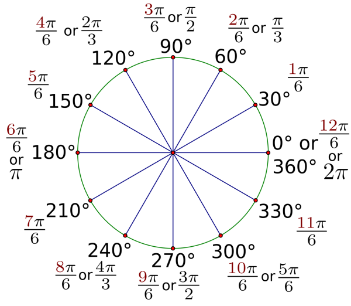

# U4LA4.2: Rotations

### Teacher Notes and Overview

This lesson introduces linear transformations: rotation.

In this lesson, students are introduced to the idea of rotating elements on the canvas. This may be something your students have already asked about if they tried to figure out things like making rectangles or ovals ‘tilted’ at some point during the year! Rotations can be static - changing things but not moving - or can be used as a part of animation by incrementing a variable that controls the angle of rotation.

Students first see rotations as part of the 8th Grade Common Core standards, and then revisit them as an important part of Geometry. Depending on the grade level of your students and your school’s math trajectory, this may be a harder ask for students to recall. If necessary, provide manipulatives for students to act out what they think is meant by rotation.

The most mind-boggling thing for students in this lesson is that the default mode for angles is radians, which many will not have heard of by the time they take this class. This is fine - students can use the `radians()` function to convert degree measures to radians in their programs.

Much like translations, rotations are cumulative so students will need to continue utilizing `pushStyle()` and `popStyle()`.

### Objectives

Students will be able to:

* Rotate shapes on the canvas
* Use incrementing variables to create animated rotations
* Combine translations with rotations

### Suggested Duration

1 period (\~45 minutes) _Plan for two days if you would look to dedicate time to having students make an animated screen saver!_

### NYS Standards

**9-12.CT.4** Implement a program using a combination of student-defined and third-party functions to organize the computation.

**9-12.CT.8** Develop a program that effectively uses control structures in order to create a computer program for practical intent, personal expression, or to address a societal issue.

**9-12.DL.1** Type proficiently on a keyboard.

**9-12.DL.2** Communicate and work collaboratively with others using digital tools to support individual learning and contribute to the learning of others.

### Vocabulary

* **Rotation -** The process of changing the angle of the object. Rotation can be clockwise or anticlockwise.&#x20;
* **`rotate()`** - Rotates a shape the amount specified by the angle parameter.&#x20;
* **Angle** - The angle of rotation, specified in radians or degrees.&#x20;
* **Radians** - The standard mathematical way to measure angles.&#x20;
* **Degrees** - A measure for angles. There are 360 degrees in a full rotation.

### Planning Notes and Materials

|                                            Planning Notes                                            |         Materials        |
| :--------------------------------------------------------------------------------------------------: | :----------------------: |
| Depending on your students' grasp of math concepts, you may want manipulatives to explain rotations. | Manipulatives (optional) |

### Resources

* [Rotation Exploration Pt 1 Starter Code](https://trinket.io/python/96cf8321a8)
* [Rotation Exploration Pt 2 Starter Code](https://trinket.io/python/32eb399d75)
* NEED VIDEO FOR PYTHON ROTATIONS
* [Radians & The Unit Circle](https://www.dummies.com/education/math/calculus/pre-calculus-unit-circle/) (Explainer)

### Assessments

**Formative:**

* Do Now Response
* Rotation Play Exercise

**Summative:**

* Screen Saver Extension (optional)
* Upcoming Unit Final Project

### Do Now/Warm Up (\~3 min)

What do you know about rotations from having done them in math classes? Write down EVERYTHING you remember, or any questions you have.

In addition to translating the grid, you can also rotate it with the `rotate()` function.&#x20;

`rotate()` takes an angle as a parameter. It then rotates the canvas around the origin point which is initially `(0, 0).` This is known as rotating around the origin.&#x20;

We can think of the origin as the center of a Ferris wheel, and everything being rotated spinning around it. If we don’t want things to spin around that point, we can translate the origin away to somewhere else.&#x20;

Our angles are measured in radians, just like with arcs. Angle is measured clockwise with zero being at 3 o'clock.&#x20;

Programs by default are in `RADIANS`, which are created in terms of pi based on a circle with a radius of 1. You can see the radians marked in terms of pi around the circle. (0 is also 2pi)

<figure><figcaption><p>Unit circle with radians and degrees marked</p></figcaption></figure>

If you would like to work in degrees, you would put any degree value into the `radians()` function to convert. For example, writing `rotate(radians(210))` is the same as writing `rotate(7*PI/6)`, and is perhaps much more intuitive for many students!

**NB:** _Generally, radians are not seen until Algebra 2/Trig (usually quite late in the year) or Pre-Calculus. If you have students who have not completed those courses, assume that seeing this diagram/hearing about radians will be absolutely shocking to them. This is okay! A best practice is to introduce radians and make sure students are aware that they are the default in most programming languages (and most calculators - this is usually a touchstone as they are used to putting their calculators into degree mode for classes and exams) because they are more precise. Degrees are less precise as 360 is a number arbitrarily chosen for its divisibility and relationship to the calendar._

The image below shows the difference between rotating with positive and negative numbers:

<figure><figcaption><p><em>Two rotations on two different canvas to demonstrate how origin and shape is shifted.</em></p></figcaption></figure>

Let's test this with a bit of play!

Go to the[ part 1 starter code](https://trinket.io/python/96cf8321a8) and do the following (after dupilcating), also listed in the program (leave your answers as comments):

* Play with the values for rotation (keep them below 6.28 for now!)
* What happens if you move the rectangle to `(0,0)`?&#x20;
* What happens if you add a translation before the rotation?&#x20;
* What if you make the rotation the center of the page?&#x20;
* What if the rotation is controlled by `mouseX` or `mouseY`?&#x20;
* What if you change the mode to degrees?&#x20;
* How could the map function help us in this situation? (You might need to make a variable for angle with this one)

This activity can be completed either independently or as a pair programming activity, depending on teacher preference.

### Changing the Rotation Origin (\~15 minutes)

It’s very important to remember that shapes in p5.js will always rotate around the point of origin (top left corner). To rotate in a different location, we’ll need to first move the origin to the proper location before rotating. Use `translate()` to move to the location where you’d like the shape, then call `rotate()`, and then draw the shape with its center at coordinate `(0,0)`.

```python
from processing import *
from collide2d import *

#modified from:genekogan.com/code/p5js-transformations/

#1. Create a variable to hold angle rotation values

def setup():
  size(510,350)

def draw():
  background(220)
  
  angle = map(mouseX, 0, width, 0, 360)
  
  pushStyle()
  translate(width/2, height/2)
  rotate(radians(angle))
  rect(-40, -20, 80, 40)
  popStyle()

draw = draw
run()
```

You can make a copy of [starter code part 2 ](https://trinket.io/python/32eb399d75)to code out the abvoe example together. Once you've tackled that, try the following challenges:

* Make shapes rotating by incrementing the angle while the shape moves its x or y position!&#x20;
* Make a shape rotate randomly&#x20;
* Make a shape rotate around its center (rectMode(CENTER) is helpful here)&#x20;
* See if rotations apply to images, text, etc!&#x20;
* Rotate around its center according to the mouse position.

### \[OPTIONAL ACTIVITY] Create a Hypnotizing Screensaver

Create a project with several shapes that all rotate in different ways - this could be done by incrementing a variable, it could be done by moving the mouse, it could happen randomly, but it should create a hypnotizing pattern that fills most of the screen.
