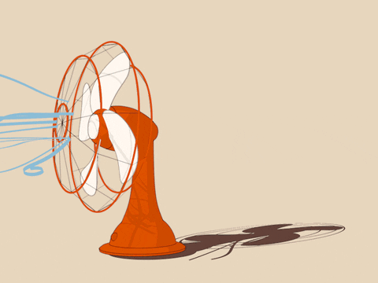

# 🤓 U4LA5.1: Sine and Oscillating Motion

### Teacher Notes and Overview

**NB:** _Learning to use sine to control movement is a great skill for students, but it does take time to talk through the numbers. If you are running short on time in your year, this lesson is absolutely skippable in the interest of getting to a fun final project - or pushing through all units, if you're being courageous - for the very end of your school year._

In this lesson, students get a brief overview of the trig ratio sine and the values it produces. They will review mapping/multiplication as methods to make these values visible and able to produce cyclical movement in Processing.py!

This lesson introduces a cool bit of code and motion, but relies on math that will probably be unfamiliar to students who do not have a strong Geometry/Algebra 2 background. While we don’t want to spend too much time in the weeds with big mathematical concepts, it is important that students understand where sine comes from. And for the benefit of their future math teachers, we are going to do our best to not make it a mysterious black box!

Based on what you know about your students, you can extend or shorten our definitions, but please avoid demonizing or mystifying math concepts so your kids won’t be horrified when they see it in other contents later on.

### Objectives

Students will be able to:

* Call sine to create values in Processing.py 
* Use sine to create cyclical motion with `map()` or by multiplying values.

### Suggested Duration

45 min - 90 minutes (depending on how much time you give them to play after the lesson!)

### NYS Standards

**9-12.CT.4** Implement a program using a combination of student-defined and third-party functions to organize the computation.

**9-12.CT.5** Modify a function or procedure in a program to perform its computation in a different way over the same inputs, while preserving the result of the overall program.

**9-12.DL.1** Type proficiently on a keyboard.

**9-12.DL.2** Communicate and work collaboratively with others using digital tools to support individual learning and contribute to the learning of others.

### Vocabulary

* **Sine** - the trigonometric function that is equal to the ratio of the side opposite a given angle (in a right triangle) to the hypotenuse. 
* **Oscillate** - to move back and forth in a consistent pattern and rate

### Planning Notes and Materials

|                                                             Planning Notes                                                            |            Materials            |
| :-----------------------------------------------------------------------------------------------------------------------------------: | :-----------------------------: |
| Preview the resources linked below - there are lots of great animations out there that might help cement this idea for your students! | _No specific materials needed._ |

### Resources

_Resources refer to original p5 sketches and need to be reworked for Processing.py syntax_

* [Intro to Sine](https://youtu.be/Dny01hFNt8g) (Youtube Video)
* [Sine Code Along](https://youtu.be/spoSN7T1FC0) (Youtube Video)
*  [Sine && Cosine Visualizer from CC Fest ](http://dexterjshepherd.com/ccfestla2018/#/5)(Extra Learning Resource)
* [Ken Chung Sine && Cosine in p5](https://editor.p5js.org/kchung/sketches/SyTz42l87) (Extra Learning Resource)

### Assessments

**Formative:**

Post-It Note Check-In (students answer one of the following):

* Describe what sin is and why it allows for oscillating motion. 
* Why does sin need to be mapped or multiplied before it can be used? 
* What is something you are struggling with or confused about related to sine?

**Summative:**

Unit 4 Project, Create a Greeting Card

### Do Now/Warm Up (\~3 minutes)

<figure><figcaption><p>Gif of oscillating fan</p></figcaption></figure>

The fan shown on above is _oscillating_. Based on what you see, what do you think it means for something to _oscillate_?

(We will be using our first trig function to create this in our Processing.py programs today!)

_Students may say things like ‘turning’ - this is a very valid answer, but it’s more than the turning, it’s the fact that it’s moving back and forth consistently. Make sure this point is driven home!_

### So, what's Sine? (\~7-10 minutes)

**NB**_**:** Again, we are assuming students are coming in with limited to no knowledge of sine and cosine. This topic is first introduced in Geometry, generally in the mid to later half of the year, and revisited in Algebra 2, but who knows what background your kids are coming in with!_&#x20;

_Please use your knowledge of your kids to decide how much of this they need. This is meant to be a mini lecture - no more than 3-5 minutes - and it should lean HEAVILY on visual examples. Students will be making visual creations, so that’s a crucial connection for them to make!_&#x20;

_The resources listed above may prove helpful, as well._

Some of you may remember sine or get flashbacks of learning SOH CAH TOA in a geometry course, but for those of you who haven’t, that’s okay! What we need to know is that sine is a trigonometric function - and anytime we see tri, we should think of triangles.

Way back when the ancient Greeks (shout out Pythagoras) noticed some very interesting relationships with right triangles. Among other things, they learned that their sides have specific ratios in relation to other parts of the triangle, and these ratios occur every. Single. Time.

**Sine** is one of those ratios that compare the opposite side from an angle to the length of the hypotenuse to create a ratio. This ratio, when converted into a decimal value, will always be a number between -1 and 1, depending on the size of the angle.

This relationship is shown in the diagram below. Note that as the angle increases in size, so does the value of **sine**, but once sine hits 1, it starts heading back down to -1, and then back up towards 1.

<figure><figcaption><p>A sine wave is created by tracing the sine values of an angle that moves around a circle</p></figcaption></figure>

### Sine in Processing.py (\~7 - 12 minutes)

### Sine in p5.js (\~7 - 12 minutes)

**NB:** _Starting here and for the following sections, the lesson is best delivered as a code-along. (If you worry about students following, consider the first two examples as board only and then move them to their own code once they start making things move.) It’s very important to show them that sine is not a mystery box - it’s a function, meaning each input has exactly one output._&#x20;

_This is why we start by not having our angle update automatically - to demystify things! Once the angle starts counting up, it may be useful to use a console.log that will print the angle and result so students can see what’s happening._

Because of this relationship of oscillation between 1 and -1, we can use the `sin()` function in Processing.py to create oscillating motion, but first we need to do a little more research into what kind of values sine is giving us.

<figure><figcaption><p>This kind of oscillating motion of a ball bouncing up and down is what we are going to create with the sin function</p></figcaption></figure>

The `sin()` function calculates the sine of an angle and assumes all angles are being measured in radians. If you would like to work with degree numbers that make more sense to you, it's recommended that you use the `radians()` function which will turn a degree measure into a radian measure. Values are returned in a range of -1 to 1.

Let's create an example and peek in the console to verify:

```python
from processing import *
from collide2d import *

angle = 15

def setup():
  size(510,350)
   

def draw():
  background(220)
  global angle
  result = sin(radians(angle))
  print(result)
  

draw = draw
run()
```

Right now, the result is giving you the **sine ratio** **of the given `angle`** (we can imagine that if this angle existed in a right triangle, this is the ratio the sides would be in). At the moment, this sine is pretty boring - it’s static and unchanging.&#x20;

If we adjust the value of the angle, we might get different numbers, but because this is a function, if you change it back to 15, you will always get the same value. The values you are getting, as expected, you get numbers between `-1` and `1`, like `0.9999914952150669`, `0.543768153489388`, `-0.4123931208391132`, and `-0.9894020617164505`.&#x20;

So, how can we make the sine change? Just like in the graph, we need to update our angle to get our sine to start changing. So let’s try this sample code, now:

```python
from processing import *
from collide2d import *

angle = 15

def setup():
  size(510,350)
   

def draw():
  background(220)
  global angle
  result = sin(radians(angle))
  print(result)
  angle+=1
  

draw = draw
run()
```

We are still getting numbers between `-1` and `1`, like `0.9999914952150669`, `0.543768153489388`, `-0.4123931208391132` and `-0.9894020617164505`. But now, they are changing each time the draw function runs, because each time we have a new angle to work with!&#x20;

As we’ve seen in the last two lessons, consistent change is how we create movement, so this is a big step forward for us.

### Sine for Movement (\~5 - 7 minutes)

**NB:** _Be sure not to skip over making the mistake of showing them that just using a -1 to 1 sine value does not actually produce visible motion. Students without the math background tend to assume that sine is just this magical creator of oscillation - and while it does help to power it, -1 to 1 are not useful numbers on their own. Making this error with the whole class makes students less likely to make it later!_&#x20;

_When kids move on to moving up and down with mapping, be sure to walk them through the steps and why each step is necessary (the first three should look familiar). Be sure to build in some brief playtime to remind students how map() works. It’s an incredibly powerful, but also incredibly intimidating, function, and we want to make sure everyone is clear on how and why to use it._

This new changing sine value is really exciting, and you might be thinking that it’s time to dive right in and try to use this result variable in a shape! So let’s try it.

```python
from processing import *
from collide2d import *

angle = 15

def setup():
  size(510,350)
   

def draw():
  background(220)
  global angle
  result = sin(radians(angle))
  angle+=1
  
  ellipse(width/2, result, 50, 50)
  

draw = draw
run()
```

So, what happened? You may have noticed that even though the result is changing, your ellipse is staying quite contentedly in one place, probably up near the top of your screen. Or, almost.&#x20;

The result is changing, and so your ellipse is moving, but as we can see from the console, those values are really small. Like, teeny tiny. So we don’t really get to see what’s happening. Luckily, we can change that - we are going to take our result and change it to a larger, more useful number.&#x20;

We have two ways to do this: map, which will give us some control over the final values or to scale by multiplication, which will just generally make our numbers bigger. Before moving to mapping, demonstrate multiplication:


```python
ellipse(width/2, (result*80) + 100, 50, 50)
#here, we add 100 to move the ellipse down the page to begin
#we then multiple the result by 80 so that all values received are between -80 and 80
```


Students can experiment with these numeric values before continuing.

### Oscillating Up and Down with Mapping (\~5 - 10 minutes)

In the example below, we use the `map()` function to get an oscillating movement from sin() that we can see. Steps 1 - 3 should be familiar as we’ve already done them together.

1. We create a variable called `angle`, which starts at zero.&#x20;
2. For every frame, we add `1` to it.&#x20;
3. Then we calculate the `sin` for each `angle`, which will be a value between `-1` and `1`.&#x20;
4. Finally, we `map` that value from the (`-1, 1)` range to a range that we can use to set the y position of our ball.

```python
from processing import *
from collide2d import *

angle = 15

def setup():
  size(510,350)
   

def draw():
  background(220)
  global angle
  sineValue = sin(radians(angle))
  y = map(sineValue, -1, 1, 50, 170)
  
  ellipse(width/2, y, 50, 50)
  angle+=1
  

draw = draw
run()
```

It’s been a while since we’ve used `map()`, so let’s take a second to play. Let’s make our canvas a bit bigger, and then experiment. What happens if we map sin from 1 to -1 instead of -1 to 1? Put a `print()` statement that says: `print(sineValue, y)`

Now, what if we make the `0,120` into `120,300` instead? What about `120,0`, or some other numbers? Think about how we could use `map()` to our advantage as we start animating.&#x20;

_Note: If you are a confident radian user and NOT converting degrees to radians, you probably already know that you will need to use many different values to add to your angle. Like, small decimal values, since each radian is represented using pi!_

### Exercise: Multiple Shapes Oscillating (\~5 - 10 minutes)

**NB:** _This is a great time to split from lecture to pair programming. Have one partner close their computer while they play on the other partner’s computer - display the prompt questions and ask students to make LOTS OF COMMENTS in their notes!_&#x20;

_Once students have had sufficient playtime, bring them back together to discuss ideas as a full class. Make sure students understand that map IS NOT being used here, but the other steps we’ve followed so far (creating an angle, calculating sine, etc) are all present._

See the example below. You’ll notice that we aren’t using any type of map function here, but the shapes are still happily bouncing along! Let’s figure out how they work. Try to do the following:

1. Play with the values for the different ellipses. What changes can you identify? What do the different values control? a) Change the "60" so they are all different numbers - make one 60 into 0 or take it away entirely. b) Change the "\* 40" to different values. What happens? c) Alter what is being added to the angle.
2. Then, try to get all the circles to start at the center of the canvas.&#x20;
3. Making the oscillation smaller or larger.&#x20;
4. Try using one of the y1/y2/y3 variables to control ellipse size - what happens?&#x20;
5. As you work through, add comments to your sketch about what you discover.

_Note: to be useful for drawing, the float values returned by sin() and cos() are usually multiplied by a larger value as you can see in this example._

```python
from processing import *
from collide2d import *

angle = 15
speed = 0.05
x = 0

def setup():
  size(510,350)
   

def draw():
  background(220)
  global angle, speed, x
  y1 = 60 + sin(angle) * 40
  y2 = 60 + sin(angle + 0.4) * 40
  y3 = 60 + sin(angle + 0.8) * 40
  ellipse( x + 80, y1, 40, 40)
  ellipse(x + 120, y2, 40, 40)
  ellipse(x + 160, y3, 40, 40)
  angle += speed
  

draw = draw
run()
```

### Exercise: Play with Oscillation (\~10 - 15 minutes)

Once you have the hang of making things oscillate, see if you can complete the following challenges:

1. Make an ellipse oscillate left and right&#x20;
2. Make another element oscillate on a diagonal&#x20;
3. Use `sin()` to control the size of something - see if you can make an emoji face that winks or screams.&#x20;
4. Make an element oscillate between 50 and 200 on the x or y-axis, but no further.&#x20;
5. Make a shape oscillate from lower-left corner to upper right and another shape that goes from upper left to lower right.

_The given prompts in the lesson are suggestions for interesting ways to use sine that will require some logic and light math. They aren’t super interesting and don’t create a meaningful project, but it’s important for kids to try to apply these ideas in a few different situations._&#x20;

_We’ve tried to be mindful about making some challenges that are best solved with `map()`, and others that are best solved with multiplication. Leave it to students to figure out which is which, or offer it as a hint once they’ve struggled for a while._

### Wrap Up

Bring students back together to share what they’ve found (have them display and talk about their code!), and collect any formative assessments.

### Extensions

Have students make a more cohesive project using sine!&#x20;

Creating a winking emoji, emoji on a rollercoaster (screaming!), or otherwise are all great ways to make students start thinking about application over just use of a skill.
