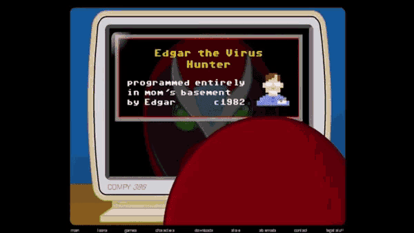
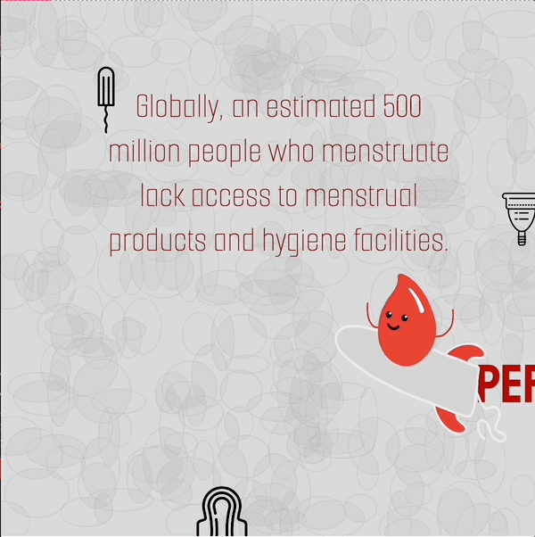

# 🎨 Unit 4 Final Project: Animated Greeting Card or PSA

### Teacher Notes

Plan on spending roughly 3-5 days on this project, depending on the speed in which your students work and how ambitious you set this project up to be.

**NB:** _Depending on your pacing, you may only make it this far in the school year - if you plan on this being your final project, consider making the scope more ambitious or opening up the prompt more to allow for maximum student creativity as they showcase their skills from the year!_

You can also adjust the parameters and prompts for this project based on the needs of your class! We generally suggest that this project be either an animated greeting card for a holiday of their choosing and/or a public service announcement for a cause of their choosing- but you can feel free to present only one option or other options depending on the needs/interests of your students. They have so many skills at their disposal that they can really make _anything -_ they might just need some information or guidance to get started!

Students will be able to:

* Showcase their understanding of animation and motion (including incrementing variables, transformations, sine/cosine) based on Unit 4 lessons in a culminating final project.&#x20;
* Utilize _at least_ one class to create _at least_ one object instance, or a group of objects
* Integrate programming skills from the duration of the year into an animated greeting card project.

### Prompt

**Close your eyes while we take a journey in the wayback machine:**

<figure><figcaption>
Animation of Strongbad from HomestarRunner using an old computer
</figcaption></figure>

In the 90s and early 2000s, the internet - and for that matter, computers - looked _much_ different. Social media did not exist, chat apps were sparse, and email was a super common way to communicate. One way people sought to make emails _fun_ was by sending little animated greeting cards straight to the inbox of their loved ones.

Flash forward to the present, where you are now armed with an almost full year's worth of computer programming skills. You're going to put those skills to use to create an interactive animation of your own in the form of either **a) a greeting card for a holiday** of your choice, or **b) a public service announement for a cause of your choice**.

**Your Task:**

Pick a holiday of your social cause of your choosing - it can be any holiday or social cause. If you are feeling creative/silly/fancy and on the holiday path, you’re also welcome to make up your own holiday. (Here is a [list of wacky holiday](http://all-funny.info/real-list-of-national-days)s if you need inspiration)

If you're picking a social cause, pick something that is important to you that you think would be good to educate others about in a fun and creative way!

**Create an animated greeting card for your holiday or an animated public service announcement/card for your social cause.**&#x20;

**Requirements**

Your card should use/have:

* At least one class creating at least one instance of an object or array of objects
* Transformations to make something translate/scale/rotate. (This thing can be moving or stationary, it’s up to you!)&#x20;
* An animation that relies on incrementing a variable, such as x += speed&#x20;
* Your choice of text, sound, or both to capture the mood of your holiday&#x20;
* Some type of user interaction (clicks, keypresses, mouse on shape collisions, etc)
* \[Optional] Sine/cosine (one or both!) to create some type of oscillating motion, circle, spiral, or size change. (It can be circular or it can just oscillate!)
* Whatever else you would like to showcase!

**Your holiday or social cause should be EASILY IDENTIFIABLE as yours, and if you are picking a social cause, the viewer should be able to learn something about it.**

**Reflection Prompts:**

* What holiday or social cause did you choose, and why did you choose it?&#x20;
* How does your card showcase and celebrate the holiday you selected, or educate on the social cause you picked?&#x20;
* Who is the target audience for this card? (Who would be sending it and who would be receiving it?)&#x20;
* Summarize all of the Processing.py skills you showcased in this project.

### Sample Output

<figure><figcaption></figcaption></figure>

### Culturally Responsive Best Practices

Within this design-based challenge, there are many prompts you can give students to make the project seem more relevant to them and the cultures of communities that they are a part of. (_Please recall that communities can refer to a lot of things, including just the culture of being a teen, a Minecraft player, or a KPop fan - be mindful that you are allowing students to explore choice in their creations in a way that is authentic to them!)_

The PSA half of this activity is easily scalable to focus students on a more social-justice focused lens; encourage students to consider causes that are important to them, and how they can bridge the gap between real-world social action and the coded PSA they have created.

**Possible CR-SE Prompts (Greeting Card Focus):**

1. Create a greeting card to celebrate any holiday you would like, real or imagined! (You wanna make a card for your birthday and only your birthday? Go for it.)
2. Create a greeting card for a holiday-specific to your cultural background, and highlighting any traditions you follow. (EX: St Nick’s day in the Midwest)
3. Create or remix a holiday that challenges traditional perception of what the holiday represents.
4. Level 3 + hide some easter eggs that can teach the user about your holiday while also celebrating it!

### Extensions

* Research on your own how to take input from a user through either a popup or an input box added to your sketch so you can find and add the name of the user to the program!&#x20;
* Research how to use millis() to count time, and trigger certain events in your program to happen after a specific amount of time has passed. (You could also use frameCount() for this, but millis() is a little more intuitive!)&#x20;
* Find a way to turn your postcard into an interactive game or scavenger hunt that the user must complete to reveal their message
